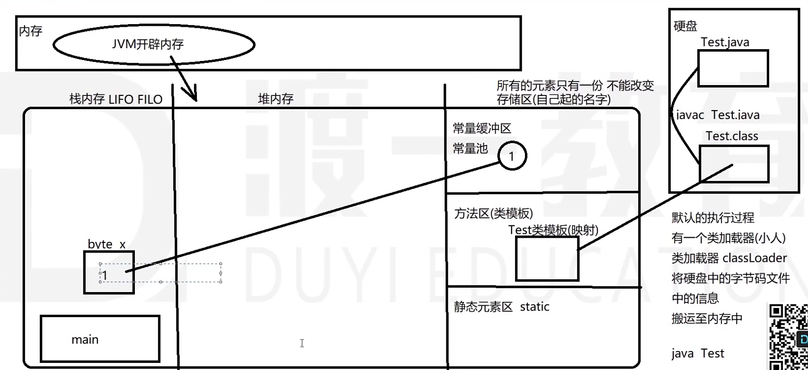
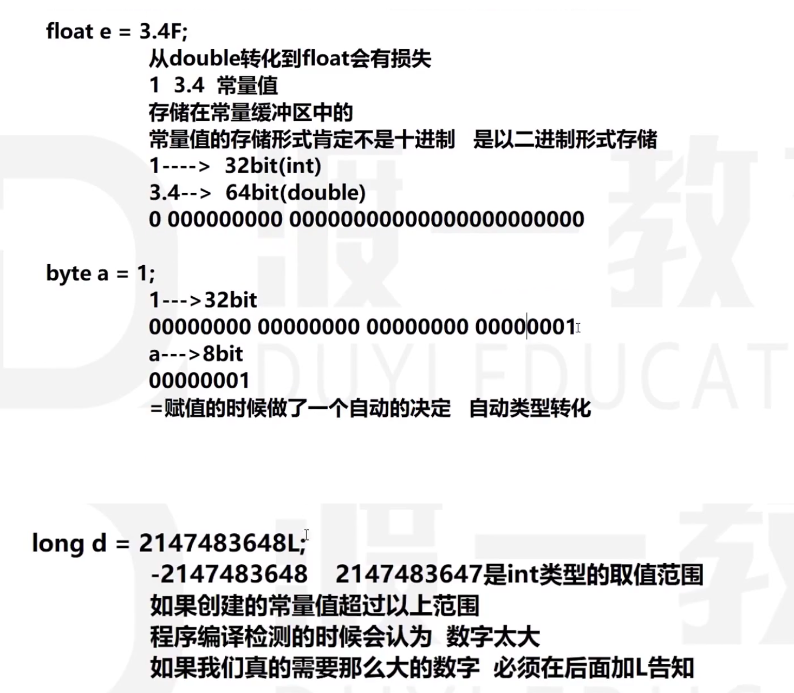

<!--
 * @Descripttion: 
 * @version: 
 * @Author: qiuxchao
 * @Date: 2022-07-22 10:44:19
 * @LastEditors: qiuxchao
 * @LastEditTime: 2022-07-27 14:33:00
-->
# 基础

## Java 编译基本流程

1. 硬盘上创建了一个文件 Test.java
2. 文件中的内容是我们编写的源代码（跟计算机发送指令）

  ```java
  // Test.java
  public class Test {
      public static void main(String[] args) {
          byte x;
          x = 1;    
      }
  }
  ```

3. 执行 `javac Test.java` 将 Test.java 源文件 -----> 编译 -------> Test.class（字节码文件，留给计算机识别）
4. 执行 `java Test` ，类加载器将 Test.class 中的类加载到内存中，然后运行 Test 类，执行 `main` 主方法
5. `main` 方法入栈，发现声明了常量 `x` ，从常量缓冲区复制 `1` 到 栈 里



## 环境搭建

> JDK（Java开发工具包） 包含 JRE（Java运行时）和 JVM（Java虚拟机）

1. 安装 JDK（JRE JVM）
2. 配置环境变量 `bin/`
3. 编写 `.java` 源代码，使用 `javac` 命令编译源代码

  ```java
  class Hello {
      public static void main(String[] args) {
          System.out.printLn("Hello World.");
      }
  }
  ```

4. 编译完成后得到 `.class` 字节码文件，使用 `java` 命令执行字节码文件

## Java 数据类型

### 八大基本数据类型

- 整型 `byte` `short` `int` `long`

- 浮点型 `float` `double`

- 字符型 `char`

- 布尔型 `boolean`

#### 基本数据类型内存容量

- `byte` 字节型：8 个 bit 敏感单元位
  - 1byte == 8bit
  - 256种组合
  - 用第一个 bit 位置来记录符号 0正数 1负数
  - 取值范围 -2的7次方 ~ 2的七次方-1，即 -128 ~ 127

- `short` 短整型：2 个 byte，16 个 bit
  - 65536 种组合
  - 取值范围 -32768 ~ 32767

- `int` 整形：4 个 byte，32 个 bit
  - 取值范围 -2147483648 ~ 2147483647

- `long` 长整型：8 个 byte，64 个 bit
  - 取值范围 -2的64次方 ~ 2的64的次方-1

- `float` 单精度浮点型：4 个 byte，32 个 bit

- `double` 双精度浮点型：8 个 byte，64 个 bit

- `char` 字符型：2 个 byte，16 个 bit
  - 用单引号 ' ' 表示，英文字符占一个字节，中文占两个字节
  - Unicode 编码

- `boolean` 布尔型：1 个 byte，8 个 bit
  - true false

### 引用数据类型

- 数组 `[]`

- 类 `class`(抽象类 `abstract class`)

- 接口 `interface`

- 枚举 `enum`

- 注解 `@interface`

## 类型转换

### 基本类型 🔁 基本类型

#### 小数据类型相同

都是整型或都是浮点

1. 大空间变量可以直接存储空间变量的数据
2. 小空间变量不可以直接存储大空间的数据（需要强制类型转换）
3. 强制转换写法都可以通过编译，但如果转换的过程中数值范围超过边界，就可能会有损失

```java
byte a = 1; int b = a; // 小空间变量放入大空间变量，不需要手动转换
int a = 1; byte b = (byte)a; // 大空间转空间，需要强制转换
float x = 3.4F; double y = x; // 无需手动转换
double x = 3.4; float y = (float)x; // 需要手动强制转换
int a = 1000; byte b = (byte)a;  // 编译通过，但最终 b 的值会发生改变，因为 int1000 转到 byte 只会保留最后 8 个 bit 位
```

#### 小数据类型不同

##### 整型 转 浮点型

1. 比较精确程度 浮点型精确度更高，可以直接存放整数，反之则需要强制转换
2. 任何一个浮点型(float/double)都可以直接存放一个整型

```java
int a = 1; float b = a; // 无需手动转换
float a = 1.0F; int b = (int)a; // 需要手动强制类型转换，转换后舍弃小数点后的部分
```

##### 整形 转 字符型

1. 每一个字符都对应着一个 Unicode 码，例如：a -- 97
2. 字符可以直接转整形，整形转字符则需要强制转换，因为整形是 32bit，而字符是 16bit

```java
char x = 'a'; int y = x; // 无需手动转换，结果 y == 97
int x = 97; char y = (int)x; // 需要强制转换，将 32bit 的 x 放入 16bit 的 y
```

##### 布尔类型很特殊

布尔类型不能与其他基本类型之间发生转换

## 运算符

运算符是用来指明对于操作值的运算方式

### 按照操作值的数目进行分类

- 单目 `a ++;`
- 双目 `a + b;`
- 三目 `(a > b) ? x : y;`

### 按照运算符的功能进行分类

- 算术运算
    1. `+` 加
    2. `-` 减
    3. `*` 乘
    4. `/` 除
    5. `%` 取余、取模
    6. `++` 自增，`++` 在前，先计算再赋值；`++` 在后先赋值再计算
    7. `--` 自减，`--` 在前，先计算再赋值；`--` 在后先赋值再计算

- 赋值运算
    1. `=` 将 `=` 右边的值存入 `=` 左边的变量空间内
    2. `+=` 复合赋值，`n = n + 1` 等价于 `n += 1`，以下复合符号同理
    3. `-=`
    4. `*=`
    5. `/=`
    6. `%=`

- 关系运算（比较）
    1. `>`  大于
    2. `>=` 大于等于
    3. `<`  小于
    4. `<=` 小于等于
    5. `!=`  不等于
    6. `==`  等于
    7. `instanceof`  验证一个对象是否是一个类的实例

- 逻辑运算
    1. `&`  逻辑与：左右全部满足时返回true
    2. `|`  逻辑或：左右有一个条件满足时返回true
    3. `^`  逻辑异或：只在左右结果不同时返回true
    4. `!`  逻辑非：单目，反转结果
    5. `&&` 短路与：左边条件不满足时，直接返回false，不再计算右边结果
    6. `||` 短路或：左边条件满足时，直接返回true，不再计算右边结果

- 位（bit）运算
    1. `&` 按位与
    2. `|` 按位或
    3. `^` 按位异或
    4. `~` 按位取反
    5. `<<`按位左位移
    6. `>>`按位右位移
    7. `>>>`按位右位移（无符号）

## 字符 char 和 字符串 String 的区别

`char` 字符类型，**基本类型**，有且只能有一个字符

`String` 字符串，**引用类型**，不受限制
| 字符 | 字符串 |
| --- | ---- |
| `char` | `String` |
| 基本类型 | 引用类型 |
| `'a'`    |  `"a"` `"abc"` `""`  |

## float & byte & long 赋值时的问题


