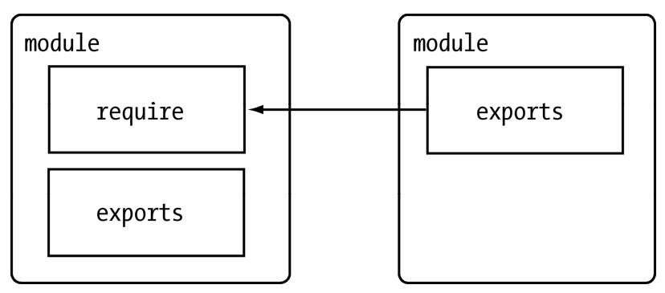

<!--
 * @Descripttion: 
 * @version: 
 * @Author: qiuxchao
 * @Date: 2022-08-01 10:26:40
 * @LastEditors: qiuxchao
 * @LastEditTime: 2022-08-01 14:32:29
-->
# CommonJS 规范

CommonJS 规范 为 JavaScript 制定了一个美好的愿景——希望 JavaScript 能够在任何地方运行。

## CommonJS 的由来

在 JavaScript 的发展历程中，它主要在浏览器前端发光发热。由于官方规范（ECMAScript）规范化的时间较早，规范涵盖的范畴非常小。这些规范中包含词法、类型、上下文、表达式、声明（statement）、方法、对象等语言的基本要素。在实际应用中，JavaScript 的表现能力取决于宿主环境中的 API 支持程度。在 Web 1.0 时代，只有对 DOM、BOM 等基本的支持。随着 Web 2.0 的推进，HTML5 崭露头角，它将 Web 网页带进 Web 应用的时代，在浏览器中出现了更多、更强大的 API 供 JavaScript 调用，这得感谢 W3C 组织对 HTML5 规范的推进以及各大浏览器厂商对规范的大力支持。但是，Web 在发展，浏览器中出现了更多的标准 API，这些过程发生在前端，后端 JavaScript 的规范却远远落后。对于JavaScript自身而言，它的规范依然是薄弱的，还有以下缺陷:

- **没有模块系统**；
- **标准库较少**。ECMAScript 仅定义了部分核心库，对于文件系统，I/O 流等常见需求却没有标准的 API。就 HTML5 的发展状况而言，W3C 标准化在一定意义上是在推进这个过程，但是它仅限于浏览器端；
- **没有标准接口**。在 JavaScript 中，几乎没有定义过如 Web 服务器或者数据库之类的标准统一接口;
- **缺乏包管理系统**。这导致 JavaScript 应用中基本没有自动加载和安装依赖的能力。

**CommonJS** 规范的提出，主要是为了弥补当前 JavaScript 没有标准的缺陷，以达到像 Python、Ruby 和 Java 具备开发大型应用的基础能力，而不是停留在小脚本程序的阶段。他们期望那些用 CommonJS API 写出的应用可以具备跨宿主环境执行的能力，这样不仅可以利用 JavaScript 开发富客户端应用，而且还可以编写以下应用:

- 服务器端 JavaScript 应用程序；
- 命令行工具；
- 桌面图形界面应用程序；
- 混合应用（Titanium和Adobe AIR等形式的应用）。

如今，CommonJS 中的大部分规范虽然依旧是草案，但是已经初显成效，为 JavaScript 开发大型应用程序指明了一条非常棒的道路。目前，它依旧在成长中，这些规范涵盖了模块、二进制、Buffer、字符集编码、I/O流、进程环境、文件系统、套接字、单元测试、Web 服务器网关接口、包管理等。

Node 借鉴 CommonJS 的 Modules规范 实现了一套非常易用的模块系统，NPM 对 Packages规范 的完好支持使得 Node 应用在开发过程中事半功倍。

## CommonJS 的模块规范

CommonJS 对模块的定义十分简单，主要分为**模块引用**、**模块定义**和**模块标识**3个部分。

### 模块引用

```js
const math = require('math');
```

在 CommonJS规范 中，存在 `require()` 方法，这个方法接受模块标识，以此引入一个模块的 API 到当前上下文中。

### 模块定义

在模块中，上下文提供 `require()` 方法来引入外部模块。对应引入的功能，上下文提供了 `exports` 对象用于导出当前模块的方法或者变量，并且它是唯一导出的出口。

在模块中，还存在一个 `module` 对象，它代表模块自身，而 `exports` 是 `module` 的属性。在 Node 中，一个文件就是一个模块，将方法挂载在 `exports` 对象上作为属性即可定义导出的方式：

```js
// math.js
exports.add = function () {
  const sum = 0,
    i = 0,
    args = arguments,
    l = args.length;
  while (i < l) {
    sum += args[i++];
  }
  return sum;
};
```

在另一个文件中，我们通过 `require()` 方法引入模块后，就能调用定义的属性或方法了：

```js
// program.js
const math = require('math');
exports.increment = function (val) {
  return math.add(val, 1);
};
```

### 模块标识

模块标识其实就是传递给 `require()` 方法的参数，它必须是符合小驼峰命名的字符串，或者以 `.`、`..` 开头的相对路径，或者绝对路径。它可以没有文件名后缀 `.js`。

模块的定义十分简单，接口也十分简洁。它的意义在于将类聚的方法和变量等限定在私有的作用域中，同时支持引入和导出功能以顺畅地连接上下游依赖。如下图所示，每个模块具有独立的空间，它们互不干扰，在引用时也显得干净利落。



CommonJS 构建的这套模块导出和引入机制使得用户完全不必考虑变量污染，命名空间等方案与之相比相形见绌。

## Node 的模块实现

Node 在实现中并非完全按照规范实现，而是对模块规范进行了一定的取舍，同时也增加了少许自身需要的特性。尽管规范中`exports`、`require` 和 `module` 听起来十分简单，但是 Node 在实现它们的过程中究竟经历了什么，这个过程需要知晓。

在 Node 中引入模块，需要经历如下3个步骤:

1. 路径分析
2. 文件定位
3. 编译执行

在 Node 中，模块分为两类：

- 一类是 Node 提供的模块，称为核心模块；
  > 核心模块部分在 Node 源代码的编译过程中，编译进了二进制执行文件。在 Node 进程启动时，部分核心模块就被直接加载进内存中，所以这部分核心模块引入时，文件定位和编译执行这两个步骤可以省略掉，并且在路径分析中优先判断，所以它的加载速度是最快的。
- 另一类是用户编写的模块，称为文件模块。
  > 文件模块在运行时动态加载，需要完整的路径分析、文件定位、编译执行过程，速度比核心模块慢。

接下来，我们展开详细的模块加载过程。

### 优先从缓存加载

展开介绍路径分析和文件定位之前，我们需要知晓的一点是，与前端浏览器会缓存静态脚本文件以提高性能一样，Node 对引入过的模块都会进行缓存，以减少二次引入时的开销。不同的地方在于，浏览器仅仅缓存文件，而 Node 缓存的是编译和执行之后的对象。

不论是核心模块还是文件模块，`require()` 方法对相同模块的二次加载都一律采用缓存优先的方式，这是第一优先级的。不同之处在于核心模块的缓存检查先于文件模块的缓存检查。

### 路径分析和文件定位

因为标识符有几种形式，对于不同的标识符，模块的查找和定位有不同程度上的差异。

#### 模块标识符分析

前面提到过，`require()` 方法接受一个标识符作为参数。在 Node 实现中，正是基于这样一个标识符进行模块查找的。模块标识符在 Node 中主要分为以下几类:

- **核心模块**，如 `http`、`fs`、`path` 等。
- `.` 或 `..` 开始的**相对路径文件模块**。
- 以 `/` 开始的**绝对路径文件模块**。
- 非路径形式的文件模块，如**自定义**的 connect 模块。

##### 核心模块

核心模块的优先级仅次于缓存加载，它在 Node 的源代码编译过程中已经编译为二进制代码，其加载过程最快。

如果试图加载一个与核心模块标识符相同的自定义模块，那是不会成功的。如果自己编写了一个 http 用户模块，想要加载成功，必须选择一个不同的标识符或者换用路径的方式。

##### 路径形式的文件模块

以 `.`、`..` 和 `/` 开始的标识符，这里都被当做文件模块来处理。在分析文件模块时，`require()` 方法会将路径转为真实路径，并以真实路径作为索引，将编译执行后的结果存放到缓存中，以使二次加载时更快。

由于文件模块给 Node 指明了确切的文件位置，所以在查找过程中可以节约大量时间，其加载速度慢于核心模块。

##### 自定义模块

自定义模块指的是非核心模块，也不是路径形式的标识符。它是一种特殊的文件模块，可能是一个文件或者包的形式。这类模块的查找是最费时的，也是所有方式中最慢的一种。

在介绍自定义模块的查找方式之前，需要先介绍一下**模块路径**这个概念。

**模块路径**是 Node 在定位文件模块的具体文件时制定的查找策略，具体表现为一个路径组成的数组。关于这个路径的生成规则，我们可以手动尝试一番。

1. 创建 `module_path.js` 文件，其内容为 `console.log(module.paths);`
2. 将其放到任意一个目录中然后执行 `node module_path.js`。将会得到这样一个数组输出：

```js
[
  '/Users/mac/Desktop/DemoCode/MyDocument/node_modules',
  '/Users/mac/Desktop/DemoCode/node_modules',
  '/Users/mac/Desktop/node_modules',
  '/Users/mac/node_modules',
  '/Users/node_modules',
  '/node_modules'
]
```

可以看出，模块路径的生成规则如下所示：

- 当前文件目录下的 `node_modules` 目录。
- 父目录下的 `node_modules` 目录。
- 父目录的父目录下的 `node_modules` 目录。
- 沿路径向上逐级递归，直到根目录下的 `node_modules` 目录。

它的生成方式与 JavaScript 的原型链或作用域链的查找方式十分类似。在加载的过程中，Node 会逐个尝试模块路径中的路径，直到找到目标文件为止。可以看出，当前文件的路径越深，模块查找耗时会越多，这是自定义模块的加载速度是最慢的原因。

#### 文件定位

从缓存加载的优化策略使得二次引入时不需要路径分析、文件定位和编译执行的过程，大大提高了再次加载模块时的效率。

但在文件的定位过程中，还有一些细节需要注意，这主要包括文件**扩展名的分析**、**目录和包的处理**。

##### 文件扩展名分析

`require()` 在分析标识符的过程中，会出现标识符中不包含文件扩展名的情况。CommonJS模块规范 也允许在标识符中不包含文件扩展名，这种情况下，Node 会按 `.js`、`.json`、`.node` 的次序补足扩展名，依次尝试。

在尝试的过程中，需要调用 `fs` 模块同步阻塞式地判断文件是否存在。因为 Node 是单线程的，所以这里是一个会引起性能问题的地方。两个小诀窍：

- 如果是 `.node` 和 `.json` 文件，在传递给 `require()` 的标识符中带上扩展名，会加快一点速度。
- 同步配合缓存，可以大幅度缓解 Node 单线程中阻塞式调用的缺陷。

##### 目录分析和包

在分析标识符的过程中，`require()` 通过分析文件扩展名之后，可能没有查找到对应文件，但却得到一个目录，这在引入自定义模块和逐个模块路径进行查找时经常会出现，此时 Node 会将目录当做一个包来处理。

在这个过程中，Node 对 CommonJS包规范 进行了一定程度的支持。首先，Node 在当前目录下查找 `package.json`（CommonJS包规范定义的包描述文件），通过 `JSON.parse()` 解析出包描述对象，从中取出 `main` 属性指定的文件名进行定位。如果文件名缺少扩展名，将会进入扩展名分析的步骤。

而如果 `main` 属性指定的文件名错误，或者压根没有 `package.json` 文件，Node 会将 `index` 当做默认文件名，然后依次查找 `index.js`、`index.json`、`index.node`。

::: tip
如果在目录分析的过程中没有定位成功任何文件，则自定义模块进入下一个模块路径进行查找。如果模块路径数组都被遍历完毕，依然没有查找到目标文件，则会抛出查找失败的异常。
:::

### 模块编译

在 Node 中，每个文件模块都是一个对象，它的定义如下：

```js
function Module(id, parent) {
  this.id = id;
  this.exports = {};
  this.parent = parent;
  if (parent && parent.children) {
    parent.children.push(this);
  }

  this.filename = null;
  this.loaded = false;
  this.children = [];
}
```

编译和执行是引入文件模块的最后一个阶段。定位到具体的文件后，Node 会新建一个模块对象，然后根据路径载入并编译。对于不同的文件扩展名，其载入方法也有所不同，具体如下所示:

- **`.js`文件**。通过 `fs` 模块同步读取文件后编译执行。
- **`.node`文件**。这是用 C/C++ 编写的扩展文件，通过 `dlopen()` 方法加载最后编译生成的文件。
- **`.json`文件**。通过 `fs` 模块同步读取文件后，用 `JSON.parse()` 解析返回结果。
- **其余扩展名文件**。它们都被当做 `.js` 文件载入。

每一个编译成功的模块都会将其文件路径作为索引缓存在 `Module._cache` 对象上，以提高二次引入的性能。

根据不同的文件扩展名，Node 会调用不同的读取方式，如 `.json` 文件的调用如下：

```js
// Native extension for .json
Module._extensions['.json'] = function(module, filename) {
  var content = NativeModule.require('fs').readFileSync(filename, 'utf8');
  try {
    module.exports = JSON.parse(stripBOM(content));
  } catch (err) {
    err.message = filename + ': ' + err.message;
    throw err;
  }
};
```

其中，`Module._extensions` 会被赋值给 `require()` 的 `extensions` 属性，所以通过在代码中访问 `require.extensions` 可以知道系统中已有的扩展加载方式。编写如下代码测试一下：

```js
console.log(require.extensions);
// { '.js': [Function], '.json': [Function], '.node': [Function] }
```

如果想对自定义的扩展名进行特殊的加载，可以通过类似 `require.extensions['.ext']` 的方式实现。早期的 CoffeeScript 文件就是通过添加 `require.extensions['.coffee']` 扩展的方式来实现加载的。但是从 v0.10.6 版本开始，官方不鼓励通过这种方式来进行自定义扩展名的加载，而是期望先将其他语言或文件编译成 JavaScript 文件后再加载，这样做的好处在于不将烦琐的编译加载等过程引入 Node 的执行过程中。

在确定文件的扩展名之后，Node 将调用具体的编译方式来将文件执行后返回给调用者。

#### JavaScript 模块的编译

回到 CommonJS 模块规范，我们知道每个模块文件中存在着 `require`、`exports`、`module` 这3个变量，但是它们在模块文件中并没有定义，那么从何而来呢？甚至在 Node 的 API 文档中，我们知道每个模块中还有 `__filename`、`__dirname` 这两个变量的存在，它们又是从何而来的呢？

事实上，在编译的过程中，Node 对获取的 JavaScript 文件内容进行了包装 `(function (exports, require, module, __filename, __dirname) {});`。一个正常的 JavaScript 文件会被包装成如下的样子：

```js
(function (exports, require, module, __filename, __dirname) {
  var math = require('math');
  exports.area = function (radius) {
    return Math.PI * radius * radius;
  };
});
```

这样每个模块文件之间都进行了作用域隔离。包装之后的代码会通过 `vm` 原生模块的 `runInThisContext()` 方法执行（类似 `eval`，只是具有明确上下文，不污染全局），返回一个具体的 `function` 对象。最后，将当前模块对象的 `exports` 属性、`require()` 方法、`module`（模块对象自身），以及在文件定位中得到的完整文件路径和文件目录作为参数传递给这个 `function()` 执行。

这就是这些变量并没有定义在每个模块文件中却存在的原因。在执行之后，模块的 `exports` 属性被返回给了调用方。`exports` 属性上的任何方法和属性都可以被外部调用到，但是模块中的其余变量或属性则不可直接被调用。

至此，`require`、`exports`、`module` 的流程已经完整，这就是 Node 对 CommonJS 模块规范的实现。

::: warning
许多初学者都曾经纠结过为何存在 `exports` 的情况下，还存在 `module.exports`。理想情况下，只要赋值给 `exports` 即可：

```js
exports = function () {};
```

但是通常都会得到一个失败的结果。其原因在于，`exports` 对象是通过形参的方式传入的，直接赋值形参会改变形参的引用，但并不能改变作用域外的值。测试代码如下：

```js
var change = function (a) {
  a = 100;
  console.log(a); // => 100
};

var a = 10;
change(a);
console.log(a); // => 10
```

如果要达到 `require` 引入一个类的效果，请赋值给 `module.exports` 对象。这个迂回的方案不改变形参的引用。
:::

#### C/C++ 模块的编译

Node 调用 `process.dlopen()` 方法进行加载和执行。在 Node 的架构下，`dlopen()` 方法在 Windows 和 *nix 平台下分别有不同的实现，通过 libuv 兼容层进行了封装。

实际上，`.node` 的模块文件并不需要编译，因为它是编写 `C/C++` 模块之后编译生成的，所以这里只有加载和执行的过程。在执行的过程中，模块的 `exports` 对象与 `.node` 模块产生联系，然后返回给调用者。

C/C++ 模块给 Node 使用者带来的优势主要是执行效率方面的，劣势则是 C/C++ 模块的编写门槛比 JavaScript 高。

#### JSON 文件的编译

`.json` 文件的编译是3种编译方式中最简单的。Node 利用 `fs` 模块同步读取 JSON 文件的内容之后，调用 `JSON.parse()` 方法得到对象，然后将它赋给模块对象的 `exports`，以供外部调用。

JSON 文件在用作项目的配置文件时比较有用。如果你定义了一个 JSON 文件作为配置，那就不必调用 `fs` 模块去异步读取和解析，直接调用 `require()` 引入即可。此外，你还可以享受到模块缓存的便利，并且二次引入时也没有性能影响。这里我们提到的模块编译都是指文件模块，即用户自己编写的模块。

> 本文摘自：深入浅出Node.js-朴灵
