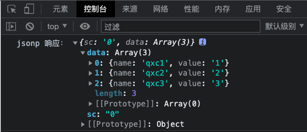

# Koa

`Koa` 是一个基于 `Nodejs` 平台的下一代 `web` 开发框架；`Koa` 由 `Express` 幕后的原班人马打造，致力于成为 `web` 应用和 `API` 开发领域中的一个更小、更富有表现力、更健壮的基石。

## Koa - 更现代的框架

- `Koa` 建立在 `es6 +` 的基础上，并且提升了现代 `js` 语法；
- 使用 `generators` 和 `async/await` 处理异步
- 优雅，简洁，灵活，体积小

## Request & Response

- `Koa` 使用的 `Request` 和 `Response` 对象是在 `node` 的原生响应对象之上的抽象；
- 通过提供一些功能加速 `HTTP` 服务开发；
- `Koa` 提供一个 `Context` 对象，表示一次对话的上下文（包括 `HTTP` 请求和 `HTTP` 回复），`Context` 将 `Node` 的 `Request` 和 `Response` 对象封装到单个对象中，为编写 `web` 应用程序和 `API` 接口提供了许多有用的方法。

## Koa 通用的插件模块

- `Koa Router` （路由）
- `Koa EJS Tpemlating`（模板引擎）
- `Koa Body Parser`（解析数据）
- `koa-json`（将响应内容设置为 json 格式）

## Koa 的优势

1. 体积小但是可以轻松扩展
2. 快速和高效
3. 现代化的 `es6+` 语法
4. 增强 `HTTP req`，`res`
5. 如果有 `express` 基础，`Koa` 会更容易上手

## Koa 基本使用

下面的代码是关于 `koa` 使用 `ejs` 模版引擎渲染数据的栗子:

```javascript
// 引入 koa 模块
const Koa = require('koa')
// json 中间件可以将响应内容转为 json 类型
const json = require('koa-json')
// 引入路由模块
const KoaRouter = require('koa-router')
// 引入 koa-ejs 模板引擎
const render = require('koa-ejs')
// 引入 path 模块
const path = require('path')
// 引入 koa-bodyparser 模块，解析post提交的数据
const bodyparser = require('koa-bodyparser')

// 实例化 koa
const app = new Koa()

// 实例化 koa-router 路由模块
const router = new KoaRouter()

// json 中间件
app.use(json())

// body-parse 解析post提交的数据
app.use(bodyparser())

// ejs 模板引擎
render(app, {
 root: path.join(__dirname, 'views'), // root 默认渲染的视图目录
 layout: 'layout', // 根布局文件，views/layout.html，此文件文根组件文件，子组件将在此文件中渲染
 viewExt: 'html', // 文件后缀名
 cache: false, // 缓存
 debug: false // 报错信息提示
})

// 设置 router 路由
app.use(router.routes()).use(router.allowedMethods)

// 监听路由地址及请求方法
router.get('/test', (ctx) => {
 ctx.body = 'Hello Test!!!'
})

// 创建一些假数据，替代数据库，通过模板引擎渲染到页面中
const things = ['读书', '制作课程', '看电影', '听音乐']

// index 主页
// router.get('/', async ctx => {
//     await ctx.render('index', {
//         title: 'Things I Love',     // 这里是传入 index.html 文件中的值
//         things: things
//     });
// });

// 使用函数渲染页面，其实就是将原来的第二个参数函数拿出来了，
// 这样就把接口都列出来，处理函数也列出来，看起来更有条理化
router.get('/', index)
router.get('/addthings', showadd)
// post 接收表单数据
router.post('/add', add)

// / 主页渲染函数
async function index(ctx) {
 await ctx.render('index', {
  title: 'Things I Love', // 这里是传入 index.html 文件中的值
  things: things
 })
}

// /addthings 渲染函数
async function showadd(ctx) {
 await ctx.render('add')
}

// post 添加事情，处理函数
async function add(ctx) {
 console.log(ctx.request.body) // 得到 post 数据
 const body = ctx.request.body
 things.push(body.thing) // 重定向到主页
 ctx.redirect('/')
}

// 搭建服务器
// ctx.body 设置响应体，默认路由为 /
// app.use(async ctx => { ctx.body = { msg: "Hello World" }});

// 监听端口
app.listen(4000, () => console.log('服务器已经在 http://localhost:4000/ 运行'))
```

栗子2:

```javascript
// 引入 koa
const Koa = require('koa')
// 解析 post 请求体
const bodyParser = require('koa-bodyparser')
const json = require('koa-json')
const Router = require('koa-router')
const path = require('path')
const render = require('koa-ejs')

// 创建 app
const app = new Koa()

// 配置模板引擎
render(app, {
 root: path.join(__dirname, 'views'), // 根路径
 layout: 'layout', // 布局文件 layout.html
 viewExt: 'html', // 渲染文件的后缀名
 cache: false, // 缓存
 debug: false // 调试
})

// 路由
const router = new Router()

// 中间件
app.use(bodyParser())
app.use(json())

// 配置路由模块
app.use(router.routes()).use(router.allowedMethods())

// 给上下文 ctx 添加属性
app.context.user = 'QiuXc'

// 假数据 DB
const things = [
 { name: 'my family' },
 { name: 'programming' },
 { name: 'music' }
]

// 路由声明
router.get('/test', (ctx) => (ctx.body = `Hello Router! ${ctx.user}`))
router.get('/test2/:id', (ctx) => (ctx.body = `路由参数是：${ctx.params.id}`))
router.get('/', index) // 主页
router.get('/add', showAdd) // 添加页
router.post('/add', addThing) // 添加页提交
router.post('/delete', deleteThing) // 删除
router.post('/edit', editThing) // 修改
// 函数声明
async function index(ctx) {
 // => / : index.html
 await ctx.render('index', {
  title: 'Things i love......',
  things: things
 })
}
async function showAdd(ctx) {
 // => /add : add.html
 await ctx.render('add')
}
async function addThing(ctx) {
 const body = ctx.request.body
 console.log(body)
 things.push({ name: body.thing })
 ctx.redirect('/')
}
async function deleteThing(ctx) {
 const body = ctx.request.body
 console.log(body)
 things.splice(parseInt(body.index), 1)
 ctx.redirect('/')
}
async function editThing(ctx) {
 const body = ctx.request.body
 console.log(body)
 things[parseInt(body.index)] = { name: body.thing }
 console.log(things)
 ctx.redirect('/')
}

// app.use(async ctx => {
//     ctx.body = { msg: 'Hello Koa!' };
// });

app.listen(3000, () => console.log('Server Started For http://localhost:3000/'))
```

## Koa 级联

`Koa` 中间件以更传统的方式级联，您可能习惯使用类似的工具 - 之前难以让用户友好地使用 `node` 的回调。然而，使用 `async` 功能，我们可以实现 “真实” 的中间件。对比 `Connect` 的实现，通过一系列功能直接传递控制，直到一个返回，`Koa` 调用“下游”，然后控制流回“上游”。

`Koa` 选择了洋葱圈模型:


> 上述为官方文档，比较难以理解，可以结合下面的代码加以理解

下面 👇 代码执行顺序：

1. `中间件1` 代码执行，`await next()` 进入到 `中间件2`，下面的 `console.log(1)` 会在 `中间件2` 执行完也就是 `next()` 执行完再执行
2. `中间件2` 代码执行，`await next()` 进入到 `中间件3`，下面的 `console.log(2)` 会在 `中间件3` 执行完也就是 `next()` 执行完再执行
3. `中间件3` 代码执行，`await next()` 时，因为没有后续的中间件，所以此时 `next()` 执行完毕，紧接着打印 `3`，然后设置响应体为 `'Hello Koa'`；`中间件3` 执行完毕
4. `中间件2` 的 `next()` 执行完毕，随即打印 `2`；`中间件2` 执行完毕
5. `中间件1` 的 `next()` 执行完毕，随即打印 `1`；至此全部执行完毕；
6. 接口响应到前端，响应体为 `'Hello Koa'`

```javascript
const Koa = require('koa')
const router = require('koa-router')()

const app = new Koa()

// 中间件1
app.use(async (ctx, next) => {
 await next()
 console.log(1)
})

// 中间件2
app.use(async (ctx, next) => {
 await next()
 console.log(2)
})

// 中间件3
app.use(async (ctx, next) => {
 await next()
 console.log(3)
 ctx.body = 'Hello Koa'
})

app.use(router.routes())
app.listen(3000, () => {
 console.log('server running on localhost:3000')
})
```

## Koa 响应 Jsonp

`koa` 响应的 `jsonp` 要注意的点就是要将 `response` 的 `type` 改为 `'text/javascript'`，并将响应体使用 `JSON.stringify` 转换后放到回调函数里，其他的请看代码

服务端代码：

```javascript
const Koa = require('koa')
const Reuter = require('koa-router')

// 创建 Koa 实例
const app = new Koa()

// 创建 koa-router 实例
const router = new Reuter()

// koa 处理 jsonp 请求
router.get('/getData.jsonp', async (ctx) => {
 // 获取回调函数名
 const callback = ctx.query.callback || 'callback'
 const data = {
  sc: '0',
  data: [
   { name: 'qxc1', value: '1' },
   { name: 'qxc2', value: '2' },
   { name: 'qxc3', value: '3' }
  ]
 }
 // 响应数据体
 const responseBody = `${callback}(${JSON.stringify(data)})`

 // 设置响应格式为 text/javascript
 ctx.type = 'text/javascript'

 // 响应数据
 ctx.body = responseBody
})

router.get('/', async (ctx) => {
 ctx.body = 'Koa Handles Jsonp'
})

// 加载路由中间件
app.use(router.routes()).use(router.allowedMethods())

app.listen(3000, () => console.log('listening on http://localhost:3000'))
```

客户端代码：

```html
<!DOCTYPE html>
<html lang="en">
 <head>
  <meta charset="UTF-8" />
  <meta http-equiv="X-UA-Compatible" content="IE=edge" />
  <meta name="viewport" content="width=device-width, initial-scale=1.0" />
  <title>Koa Jsonp</title>
 </head>
 <body>
  <script>
   // 1. 创建接收数据的回调函数
   const getData = (data) => {
    console.log('jsonp 响应：', data)
   }

   // 2. 创建 script 标签，设置type、async、和 src(后端接口地址，callback就是上面定义的回调函数)
   const script = document.createElement('script')
   script.type = 'text/javascript'
   script.async = true
   script.src = 'http://localhost:3000/getData.jsonp?callback=getData'

   // 3. 向 body 中添加 script 标签，添加后自动发起请求
   document.body.appendChild(script)
  </script>
 </body>
</html>
```

客户端请求结果：<br>


