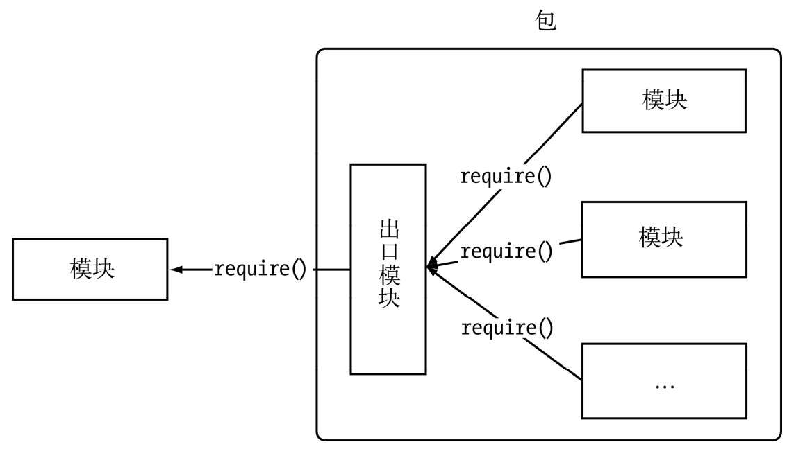
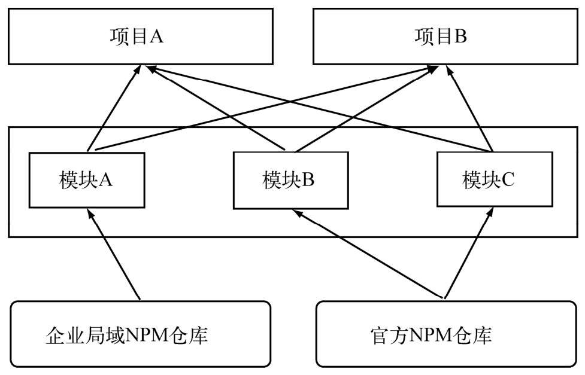

<!--
 * @Descripttion: 
 * @version: 
 * @Author: qiuxchao
 * @Date: 2022-07-08 15:28:24
 * @LastEditors: qiuxchao
 * @LastEditTime: 2022-08-02 17:05:56
-->
# 包 & npm

Node组织了自身的核心模块，也使得第三方文件模块可以有序地编写和使用。但是在第三方模块中，模块与模块之间仍然是散列在各地的，相互之间不能直接引用。而在模块之外，包和NPM则是将模块联系起来的一种机制。

在介绍NPM之前，不得不提起CommonJS的包规范。JavaScript不似Java或者其他语言那样，具有模块和包结构。Node对模块规范的实现，一定程度上解决了变量依赖、依赖关系等代码组织性问题。包的出现，则是在模块的基础上进一步组织JavaScript代码。下图为包组织模块示意图。



CommonJS的包规范的定义其实也十分简单，它由包结构和包描述文件两个部分组成，前者用于组织包中的各种文件，后者则用于描述包的相关信息，以供外部读取分析。

## 包结构

包实际上是一个存档文件，即一个目录直接打包为 `.zip` 或 `.tar.gz` 格式的文件，安装后解压还原为目录。完全符合CommonJS规范的包目录应该包含如下这些文件:

- `package.json`：包描述文件。

- `bin`：用于存放可执行二进制文件的目录。

- `lib`：用于存放JavaScript代码的目录。

- `doc`：用于存放文档的目录。

- `test`：用于存放单元测试用例的代码。

可以看到，CommonJS包规范从文档、测试等方面都做过考虑。当一个包完成后向外公布时，用户看到单元测试和文档的时候，会给他们一种踏实可靠的感觉。

## 包描述文件与NPM

包描述文件用于表达非代码相关的信息，它是一个JSON格式的文件——`package.json`，位于包的根目录下，是包的重要组成部分。而NPM的所有行为都与包描述文件的字段息息相关。由于CommonJS包规范尚处于草案阶段，NPM在实践中做了一定的取舍，具体细节在后面会介绍到。

CommonJS为 `package.json` 文件定义了如下一些必需的字段:

- `name`。包名。规范定义它需要由小写的字母和数字组成，可以包含 `.`、`_` 和 `-`，但不允许出现空格。包名必须是唯一的，以免对外公布时产生重名冲突的误解。除此之外，NPM还建议不要在包名中附带上`node`或`js`来重复标识它是JavaScript或Node模块。

- `description`。包简介。

- `version`。版本号。一个语义化的版本号，这在<http://semver.org/>上有详细定义，通常为`major.minor.revision`格式。该版本号十分重要，常常用于一些版本控制的场合。

- `keywords`。关键词数组，NPM中主要用来做分类搜索。一个好的关键词数组有利于用户快速找到你编写的包。

- `maintainers`。包维护者列表。每个维护者由`name`、`email`和`web`这3个属性组成。示例如下：

  ```json
  {
    "maintainers": [{ "name": "Jackson Tian", "email":"shyvo1987@gmail.com", "web": "http://html5ify.com" }]
  }
  ```

  NPM通过该属性进行权限认证。

- `contributors`。贡献者列表。在开源社区中，为开源项目提供代码是经常出现的事情，如果名字能出现在知名项目的contributors列表中，是一件比较有荣誉感的事。列表中的第一个贡献应当是包的作者本人。它的格式与维护者列表相同。

- `bugs`。一个可以反馈bug的网页地址或邮件地址。

- `licenses`。当前包所使用的许可证列表，表示这个包可以在哪些许可证下使用。它的格式如下：

  ```json
  {
    "licenses": [{ "type": "GPLv2", "url": "http://www.example.com/licenses/gpl.html", }]
  }
  ```

- `dependencies`。使用当前包所需要依赖的包列表。这个属性十分重要，NPM会通过这个属性帮助自动加载依赖的包。

- `repositories`。托管源代码的位置列表，表明可以通过哪些方式和地址访问包的源代码。

除了必选字段外，规范还定义了一部分可选字段，具体如下所示:

- `homepage`。当前包的网站地址。

- `os`。操作系统支持列表。这些操作系统的取值包括aix、freebsd、linux、macos、solaris、vxworks、windows。如果设置了列表为空，则不对操作系统做任何假设。

- `cpu`。CPU架构的支持列表，有效的架构名称有arm、mips、ppc、sparc、x86和x86_64。同os一样，如果列表为空，则不对CPU架构做任何假设。

- `engine`。支持的JavaScript引擎列表，有效的引擎取值包括ejs、flusspferd、gpsee、jsc、spidermonkey、narwhal、node和v8。

- `builtin`。标志当前包是否是内建在底层系统的标准组件。

- `directories`。包目录说明。

- `implements`。实现规范的列表。标志当前包实现了CommonJS的哪些规范。

- `scripts`。脚本说明对象。它主要被包管理器用来安装、编译、测试和卸载包。示例如下：

  ```json
  {
    "scripts": { 
      "install": "install.js",
      "uninstall": "uninstall.js",
      "build": "build.js",
      "doc": "make-doc.js",
      "test": "test.js"
    }
  }
  ```

包规范的定义可以帮助Node解决依赖包安装的问题，而NPM正是基于该规范进行了实现。

在包描述文件的规范中，NPM实际需要的字段主要有 `name`、`version`、`description`、`keywords`、`repositories`、`author`、`bin`、`main`、`scripts`、`engines`、`dependencies`、`devDependencies`。与包规范的区别在于多了 `author`、`bin`、`main` 和 `devDependencies` 这4个字段，下面补充说明一下:

- `author`。包作者。

- `bin`。一些包作者希望包可以作为命令行工具使用。配置好 `bin` 字段后，通过 `npm install package_name -g` 命令可以将脚本添加到执行路径中，之后可以在命令行中直接执行。node-gyp即是这样安装的。通过 `-g` 命令安装的模块包称为全局模式。

- `main`。模块引入方法 `require()` 在引入包时，会优先检查这个字段，并将其作为包中其余模块的入口。如果不存在这个字段，`require()` 方法会查找包目录下的 `index.js`、`index.node`、`index.json` 文件作为默认入口。

- `devDependencies`。一些模块只在开发时需要依赖。配置这个属性，可以提示包的后续开发者安装依赖包。

下面是知名框架 `express` 项目的 `package.json` 文件，具有一定的参考意义：

```json
{
  "name": "express",
  "description": "Sinatra inspired web development framework",
  "version": "3.3.4",
  "author": "TJ Holowaychuk <tj@vision-media.ca>",
  "contributors": [
    {
      "name": "TJ Holowaychuk",
      "email": "tj@vision-media.ca"
    },
    {
      "name": "Aaron Heckmann",
      "email": "aaron.heckmann+github@gmail.com"
    },
    {
      "name": "Ciaran Jessup",
      "email": "ciaranj@gmail.com"
    },
    {
      "name": "Guillermo Rauch",
      "email": "rauchg@gmail.com"
    }
  ],
  "dependencies": {
    "connect": "2.8.4",
    "commander": "1.2.0",
    "range-parser": "0.0.4",
    "mkdirp": "0.3.5",
    "cookie": "0.1.0",
    "buffer-crc32": "0.2.1",
    "fresh": "0.1.0",
    "methods": "0.0.1",
    "send": "0.1.3",
    "cookie-signature": "1.0.1",
    "debug": "*"
  },
  "devDependencies": {
    "ejs": "*",
    "mocha": "*",
    "jade": "0.30.0",
    "hjs": "*",
    "stylus": "*",
    "should": "*",
    "connect-redis": "*",
    "marked": "*",
    "supertest": "0.6.0"
  },
  "keywords": [
    "express",
    "framework",
    "sinatra",
    "web",
    "rest",
    "restful",
    "router",
    "app",
    "api"
  ],
  "repository": "git://github.com/visionmedia/express",
  "main": "index",
  "bin": {
    "express": "./bin/express"
  },
  "scripts": {
    "prepublish": "npm prune",
    "test": "make test"
  },
  "engines": {
    "node": "*"
  }
}
```

## NPM常用功能

CommonJS包规范是理论，NPM是其中的一种实践。NPM之于Node，相当于gem之于Ruby, pear之于PHP。对于Node而言，NPM帮助完成了第三方模块的发布、安装和依赖等。借助NPM, Node与第三方模块之间形成了很好的一个生态系统。

借助NPM，可以帮助用户快速安装和管理依赖包。除此之外，NPM还有一些巧妙的用法，下面我们详细介绍一下。

### 查看帮助

在安装Node之后，执行 `npm -v` 命令可以查看当前NPM的版本：

```sh
npm -v
```

在不熟悉NPM的命令之前，可以直接执行 `npm` 查看到帮助引导说明：

```sh
npm
```

### 安装依赖包

安装依赖包是NPM最常见的用法，它的执行语句是 `npm install express`。执行该命令后，NPM会在当前目录下创建 `node_modules` 目录，然后在 `node_modules` 目录下创建 `express` 目录，接着将包解压到这个目录下。

安装好依赖包后，直接在代码中调用 `require('express')`；即可引入该包。`require()` 方法在做路径分析的时候会通过模块路径查找到 `express` 所在的位置。模块引入和包的安装这两个步骤是相辅相承的。

#### 全局模式安装

如果包中含有命令行工具，那么需要执行 `npm install express -g` 命令进行全局模式安装。需要注意的是，全局模式并不是将一个模块包安装为一个全局包的意思，它并不意味着可以从任何地方通过 `require()` 来引用到它。

全局模式这个称谓其实并不精确，存在诸多误导。实际上，`-g` 是将一个包安装为全局可用的可执行命令。它根据包描述文件中的 `bin` 字段配置，将实际脚本链接到与Node可执行文件相同的路径下：

```json
{
  "bin": {
    "express": "./bin/express"
  },
}
```

事实上，通过全局模式安装的所有模块包都被安装进了一个统一的目录下，这个目录可以通过如下方式推算出来：

```js
path.resolve(process.execPath, '..', '..', 'lib', 'node_modules');
```

如果Node可执行文件的位置是 `/usr/local/bin/node`，那么模块目录就是 `/usr/local/lib/node_modules`。最后，通过软链接的方式将 `bin` 字段配置的可执行文件链接到Node的可执行目录下

#### 从本地安装

对于一些没有发布到NPM上的包，或是因为网络原因导致无法直接安装的包，可以通过将包下载到本地，然后以本地安装。

本地安装只需为NPM指明 `package.json` 文件所在的位置即可：它可以是一个包含 `package.json` 的存档文件，也可以是一个URL地址，也可以是一个目录下有 `package.json` 文件的目录位置。具体参数如下：

```sh
npm install <tarball file>
npm install <tarball url>
npm install <folder>
```

#### 从非官方源安装

如果不能通过官方源安装，可以通过镜像源安装。在执行命令时，添加 `--registry=http://registry.url` 即可，示例如下：

```sh
npm install underscore --registry=http://registry.url
```

如果使用过程中几乎都采用镜像源安装，可以执行以下命令指定默认源：

```sh
npm config set registry http://registry.url
```

### NPM钩子命令

另一个需要说明的是C/C++模块实际上是编译后才能使用的。`package.json` 中 `scripts` 字段的提出就是让包在安装或者卸载等过程中提供钩子机制，示例如下：

```json
{
  "scripts": {
    "preinstall": "preinstall.js",
    "install": "install.js",
    "uninstall": "uninstall.js",
    "test": "test.js"
  }
}
```

在以上字段中执行 `npm install <package>` 时，`preinstall` 指向的脚本将会被加载执行，然后 `install` 指向的脚本会被执行。在执行 `npm uninstall <package>` 时，`uninstall` 指向的脚本也许会做一些清理工作等。

当在一个具体的包目录下执行 `npm test` 时，将会运行 `test` 指向的脚本。一个优秀的包应当包含测试用例，并在 `package.json` 文件中配置好运行测试的命令，方便用户运行测试用例，以便检验包是否稳定可靠。

### 发布包

为了将整个NPM的流程串联起来，这里将演示如何编写一个包，将其发布到NPM仓库中，并通过NPM安装回本地。

#### 编写模块

模块的内容我们尽量保持简单，这里还是以sayHello作为例子，相关代码如下：

```js
exports.sayHello = function () {
  return 'Hello, world.';
};
```

将这段代码保存为hello.js即可。

#### 初始化包描述文件

`package.json` 文件的内容尽管相对较多，但是实际发布一个包时并不需要一行一行编写。

NPM提供的 `npm init` 命令会帮助你生成 `package.json` 文件，具体如下所示：

```sh
npm init --y
```

#### 注册包仓库账号

为了维护包，NPM必须要使用仓库账号才允许将包发布到仓库中。

注册账号的命令是 `npm adduser`。这也是一个提问式的交互过程，按顺序进行即可：

```sh
$ npm adduser
Username: (jacksontian)
Email: (shyvo1987@gmail.com)
```

#### 上传包

上传包的命令是 `npm publish <folder>` 。

在刚刚创建的 `package.json` 文件所在的目录下，执行 `npm publish .` 开始上传包，相关代码如下：

```sh
npm publish .
```

在这个过程中，NPM会将目录打包为一个存档文件，然后上传到官方源仓库中。

#### 安装包

为了体验和测试自己上传的包，可以换一个目录执行 `npm install hello_test_jackson` 安装它：

```sh
npm install hello_test_jackson --registry=http://registry.npmjs.org
```

#### 管理包权限

通常，一个包只有一个人拥有权限进行发布。如果需要多人进行发布，可以使用 `npm owner` 命令帮助你管理包的所有者：

```sh
npm owner ls eventproxy
```

使用这个命令，也可以添加包的拥有者，删除一个包的拥有者：

```sh
npm owner ls <package name>
npm owner add <user> <package name>
npm owner rm <user> <package name>
```

### 分析包

在使用NPM的过程中，或许你不能确认当前目录下能否通过 `require()` 顺利引入想要的包，这时可以执行 `npm ls` 分析包。这个命令可以为你分析出当前路径下能够通过模块路径找到的所有包，并生成依赖树，如下：

```sh
$ npm ls
/Users/jacksontian
  ├─┬ connect@2.0.3
  │ ├── crc@0.1.0
  │ ├── debug@0.6.0
  │ ├── formidable@1.0.9
  │ ├── mime@1.2.4
  │ └── qs@0.4.2
  ├── hello_test_jackson@0.0.1
  └── urllib@0.2.3
```

### 配置项目npm源

在项目根目录下创建 `.npmrc` 文件，写入：

```
registry="https://registry.npmjs.org/"
```

通过命令 `npm config ls` 查看当前项目下的 `registry` 是否发生了变化

配置完成后，npm 源地址只在此项目中生效，并不会对全局 npm 的配置影响，可以在别的终端上通过命令 `npm config ls` 进行验证


## 私有NPM

在企业的内部应用中使用NPM与开源社区中使用有一定的差别。企业的限制在于，一方面需要享受到模块开发带来的低耦合和项目组织上的好处，另一方面却要考虑到模块保密性的问题。所以，通过NPM共享和发布存在潜在的风险。

为了同时能够享受到NPM上众多的包，同时对自己的包进行保密和限制，现有的解决方案就是企业搭建自己的NPM仓库。

所幸，NPM自身是开源的，无论是它的服务器端和客户端。通过源代码搭建自己的仓库并不是什么秘密。

局域NPM仓库的搭建方法与搭建镜像站（详情可参见附录D）的方式几乎一样。

与镜像仓库不同的地方在于，企业局域NPM可以选择不同步官方源仓库中的包。下图为企业中混合使用官方仓库和局域仓库的示意图。



对于企业内部而言，私有的可重用模块可以打包到局域NPM仓库中，这样可以保持更新的中心化，不至于让各个小项目各自维护相同功能的模块，杜绝通过复制粘贴实现代码共享的行为。

## NPM潜在问题

作为为模块和包服务的工具，NPM十分便捷。它实质上已经是一个包共享平台，所有人都可以贡献模块并将其打包分享到这个平台上，也可以在许可证（大多是MIT许可证）的允许下免费使用它们。NPM提供的这些便捷，将模块链接到一个共享平台上，缩短了贡献者与使用者之间的距离，这十分有利于模块的传播，进而也十分利于Node的推广。几乎没有一种语言或平台有Node这样出现才3年多就拥有成千上万个第三方模块的情景。这个功劳一部分是因为Node选择了JavaScript，这门语言拥有极大的开发人员基数，具有强大的生产力；另一部分则是因为CommonJS规范和NPM，它们使得产品能够更好地组织、传播和使用。

潜在的问题在于，在NPM平台上，每个人都可以分享包到平台上，鉴于开发人员水平不一，上面的包的质量也良莠不齐。另一个问题则是，Node代码可以运行在服务器端，需要考虑安全问题。

对于包的使用者而言，包质量和安全问题需要作为是否采纳模块的一个判断条件。

尽管NPM没有硬性的方式去评判一个包的质量和安全，好在开源社区也有它内在的健康发展机制，那就是口碑效应，其中NPM模块首页（<https://npmjs.org/>）上的依赖榜可以说明模块的质量和可靠性。第二个可以考查质量的地方是GitHub, NPM中大多的包都是通过GitHub托管的，模块项目的观察者数量和分支数量也能从侧面反映这个模块的可靠性和流行度。第三个可以考量包质量的地方在于包中的测试用例和文档的状况，一个没有单元测试的包基本上是无法被信任的，没有文档的包，使用者使用时内心也是不踏实的。

在安全问题上，在经过模块质量的考查之后，应该可以去掉一大半候选包。基于使用者大多是JavaScript程序员，难点其实存在于第三方C/C++扩展模块，这类模块建议在企业的安全部门检查之后方可允许使用。

事实上，为了解决上述问题，Isaac Z. Schlueter计划引入CPAN社区中的Kwalitee风格来让模块进行自然排序。Kwalitee是一个拟声词，发音与quality相同。CPAN社区对它的原始定义如下：
> “Kwalitee”is something that looks like quality, sounds like quality, but is not quite quality.

大致意思就是确认一个模块的质量是否优秀并不是那么容易，只能从一些表象来进行考查，但即便考查都通过，也并不能确定它就是高质量的模块。这个方法能够排除大部分不合格的模块，虽然不够精确但是有效。总体而言，符合Kwalitee的模块要满足的条件与下述提及的考查点大致相同:

- 具备良好的测试。
- 具备良好的文档（README、API）。
- 具备良好的测试覆盖率。
- 具备良好的编码规范。
- 更多条件。

CPAN社区制定了相当多的规范来考查模块。未来，NPM社区也会有更多的规范来考查模块。读者可以根据这些条款区分出那些优秀的模块和糟粕的模块。

> 本文摘自：深入浅出Node.js-朴灵
