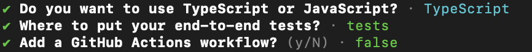
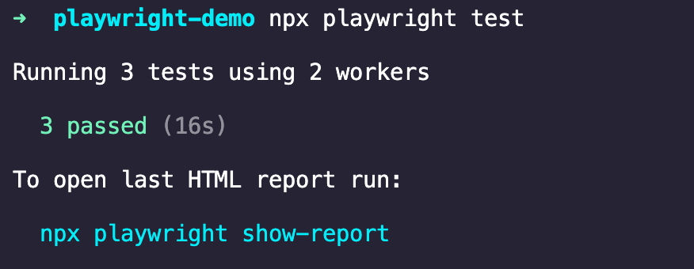
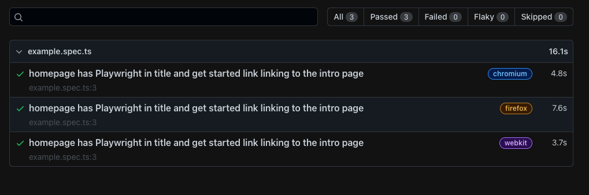

<!--
 * @Descripttion: 
 * @version: 
 * @Author: qiuxchao
 * @Date: 2022-09-06 09:34:08
 * @LastEditors: qiuxchao
 * @LastEditTime: 2022-09-06 11:08:22
-->
# 🎭 Playwright 一个 Nodejs 自动化测试工具

[Playwright](https://playwright.dev/) 是微软专门为满足端到端测试的需求而创建的。

Playwright 支持的语言有：Nodejs、Python、Java、.NET

Playwright 支持所有现代渲染引擎，包括 Chromium、WebKit 和 Firefox。在 Windows、Linux 和 macOS 上进行本地或 CI 测试，无头或使用适用于 Android 和 Mobile Safari 的 Google Chrome 的本机移动仿真进行测试。

> 如果你用过 Python 的 Selenium，那你一定知道 Playwright 的用途。

## 安装

通过使用 npm 或 yarn 安装 Playwright 开始。或者，也可以使用 [VS Code 扩展](https://marketplace.visualstudio.com/items?itemName=ms-playwright.playwright)开始并运行我们的测试。

使用 yarn 或 npm 安装：

```sh
# yarn
yarn create playwright

# npm
npm init playwright@latest
```

在安装过程中 playwright 脚手架会向我们询问三个问题：



1. 在 TypeScript 或 JavaScript 之间进行选择（默认为 TypeScript）
2. 测试文件夹的名称（如果项目中已经有一个测试文件夹，则默认为 tests 或 e2e）
3. 添加 GitHub Actions 工作流程以在 CI 上运行测试

回答完这三个问题后将开始安装流程。

安装完成后目录结构为：

```sh
playwright.config.ts
package.json
package-lock.json
tests/
  example.spec.ts
tests-examples/
  demo-todo-app.spec.ts
```

- `playwright.config` 是为 Playwright 添加配置的地方，包括修改我们希望在哪些浏览器上运行 Playwright。如果在已经存在的项目中运行测试，那么依赖项将直接添加到 `package.json` 中。

- `tests` 文件夹包含一个基本示例测试，可帮助我们开始测试。有关更详细的示例，请查看 `tests-examples` 文件夹，其中包含为测试 todo 应用程序而编写的测试。

## 运行

默认情况下，测试将在所有 3 个浏览器上运行，chrome、firefox 和 webkit，使用 3 个 worker。这可以在 `playwright.config` 文件中进行配置。测试以无头模式运行，这意味着在运行测试时不会打开任何浏览器。测试结果和测试日志将显示在终端中。

键入以下命令以运行测试：

```sh
npx playwright test
```



测试运行完成后，将创建一个 HTML 文件，它记录了完整的测试报告，允许我们在网页中筛选报告，通过的测试、失败的测试、跳过的测试和不稳定的测试。可以单击每个测试查看测试的错误以及测试的每个步骤。默认情况下，如果某些测试失败，HTML 报告会自动打开。

也可以输入以下命令打开报告页面：

```sh
npx playwright show-report
```




## 示例

在百度中搜索 `Playwright`，验证第一条是不是官方地址：

```ts
import { test, expect } from '@playwright/test';

test('在百度中搜索Playwright', async ({ page }) => {
  // 打开百度搜索页面
  await page.goto('https://www.baidu.com/');
  
  // 查看标题中是否有「百度一下，你就知道」文案
  await expect(page).toHaveTitle(/百度一下，你就知道/);

  // 找到搜索框元素并输入「Playwright」
  await page.locator('input#kw').fill('Playwright');

  // 找到「百度一下」按钮并点击
  await page.locator('input[value=百度一下]').click();

  // 找到结果列表中第一条 这里使用的 Xpath
  const result = await page.locator('/html/body/div[2]/div[3]/div[1]/div[3]/div[1]/div[3]/a/span');
  
  // 验证第一条是不是官方地址
  expect(result).toHaveText('https://github.com/microsoft/playwright');
});
```

[Playwright](https://playwright.dev/) 功能强大，本文只做简单阐述，如要深入了解可以前往[官方文档](https://playwright.dev/docs/intro)
