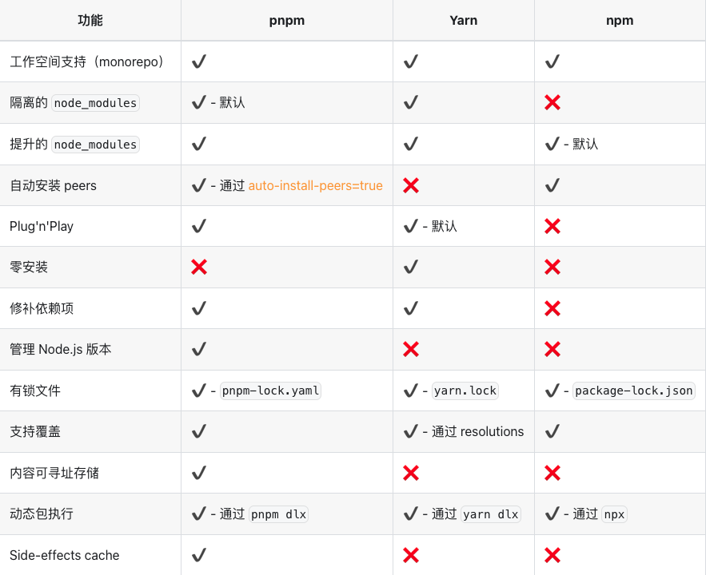

<!--
 * @Descripttion: 
 * @version: 
 * @Author: qiuxchao
 * @Date: 2022-08-03 11:33:54
 * @LastEditors: qiuxchao
 * @LastEditTime: 2022-08-03 13:33:00
-->
# pnpm

pnpm 是快速的，节省磁盘空间的包管理工具。

- **快速**。pnpm 比其他包管理器快 2 倍；

- **高效**。从全局 store 硬连接到 node_modules/.pnpm，然后之间通过软链接来组织依赖关系；

- **支持 monorepos**。pnpm 内置支持单仓多包；

- **严格**。pnpm 默认创建了一个非平铺的 node_modules，因此代码无法访问任意包，解决了幽灵依赖。

## pnpm 与 yarn、npm 功能比较



## 安装 & 使用

安装

```sh
sudo npm install -g pnpm
```

使用

| npm命令 | pnpm等效 |
| ------ | ------- |
|  `npm install` | `pnpm install`  |
|  `npm i <pkg>` | [`pnpm add <pkg>`]  |
|  `npm run <cmd>`  |   [`pnpm <cmd>`]  |
