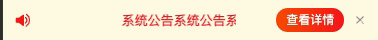

<!--
 * @Descripttion: 
 * @version: 
 * @Author: qiuxchao
 * @Date: 2022-08-09 19:30:09
 * @LastEditors: qiuxchao
 * @LastEditTime: 2022-08-11 11:33:20
-->
# 微信小程序滚动通知条

这篇文章来实现一下小程序中的滚动通知条，先看效果：



用到的技术点：

- `wx.createSelectorQuery().select().boundingClientRect()`：获取节点的布局位置。以像素为单位。其功能类似于 DOM 的 getBoundingClientRect；

- `bind:transitionend` html原生事件处理函数，在某个 CSS transition 完成时触发。

## 代码实现

先把 `wx.createSelectorQuery()` 封装为返回 `Promise` 的方法，便于后续配合 `async await` 使用:
::: details utils.js

```js
/**
 * Promise 获取节点的布局位置
 * @param {object} self 调用该方法时作用域中的 this
 * @param {string} selector css 元素选择器
 * @returns {Promise} 节点布局位置信息
 */
export const getBoundingClientRect = (self, selector) =>
  new Promise((resolve, reject) => {
    (!self || !self.createSelectorQuery || !selector) && reject();
    self
      .createSelectorQuery()
      .select(selector)
      .boundingClientRect(res => {
        resolve(res);
      })
      .exec();
  });
```

:::

页面结构代码：
::: details index.wxml

```html
<view class="sys-notice">
  <g-iconfont name="ic_message" size="32" color="#ff1919" />
  <view class="sys-notice-content ml-8 mr-40">
    <text
      class="sys-notice-content-text"
      style="transform: {{noticeTransform}}; transition-duration: {{noticeTransitionDuration}}"
      bind:transitionend="bindStartNoticeScroll"
      >
      {{sysNotice}}
      </text>
  </view>
  <button class="btn" type="primary" size="small" catch:tap="handleLookNotice">查看详情</button>
</view>
```

:::

样式代码：

::: details index.less

```less
.sys-notice {
  height: 88rpx;
  background: #fefae5;
  display: flex;
  align-items: center;
  padding: 20rpx 24rpx;
  font-size: 26rpx;
  color: @theme-color;
  box-sizing: border-box;
  &-content {
    width: 398rpx;
    overflow: hidden;
    position: relative;
    height: 100%;
    display: flex;
    align-items: center;
    &-text {
      width: auto;
      transition-timing-function: linear;
      position: absolute;
      white-space: nowrap;
    }
  }
  .btn {
    width: 136rpx;
    background-image: @theme-bg;
    border-radius: 24rpx;
  }
}
```

:::

js 代码：
::: details index.js

```js
import { getBoundingClientRect } from './util';

Component({
  options: {
    addGlobalClass: true,
  },
  data: {
    sysNotice: '', // 系统公告
    noticeTransform: '',
    noticeTransitionDuration: '',
  },

  lifetimes: {
    attached() {
      this.getSysNotice();
    },
  },

  methods: {
    getSysNotice() {
      this.setData({ sysNotice: '系统公告系统公告系统公告系统公告系统公告系统公告系统公告' }, async () => {
        // 滚动外层节点
        this.sysNoticeContentRef = await getBoundingClientRect(this, '.sys-notice-content');
        // 滚动文本节点
        this.sysNoticetextRef = await getBoundingClientRect(this, '.sys-notice-content-text');
        this.bindStartNoticeScroll();
      });
    },

    // 通知滚动
    async bindStartNoticeScroll() {
      const { noticeTransform } = this.data;
      const { sysNoticeContentRef: contentRef, sysNoticetextRef: textRef } = this;
      if (!contentRef || !textRef) return;
      // 是否为第一次滚动
      const initial = !noticeTransform;
      this.setData({
        noticeTransitionDuration: '0s',
        noticeTransform: initial ? 'translateX(0)' : `translateX(${contentRef.width}px)`,
      });
      // setData 回调和 wx.nextTick 均会出现 translateX 移动位置后视图不渲染的问题，故这里使用 setTimeout，给视图足够的时间渲染
      setTimeout(() => {
        const distance = initial ? textRef?.width : contentRef.width + textRef.width;
        this.setData({
        noticeTransitionDuration: `${Math.round(distance / 50)}s`,  // 距离 / 速度 = 时间
        noticeTransform: `translateX(-${textRef.width}px)`,
      });
      }, 200);
    },

  },
});

```

:::
