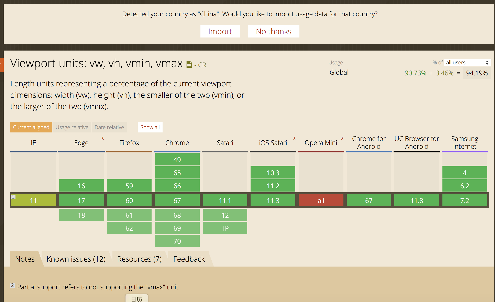

<!--
 * @Descripttion: 
 * @version: 
 * @Author: qiuxchao
 * @Date: 2022-07-21 19:53:24
 * @LastEditors: qiuxchao
 * @LastEditTime: 2022-07-27 14:35:04
-->
# 通过vw、vh来实现自适应

## 什么是 vw/vh ?

css3 中引入了一个新的单位 `vw`/`vh`，与视图窗口有关，`vw` 表示相对于视图窗口的宽度，`vh` 表示相对于视图窗口高度，除了 vw 和 vh 外，还有 `vmin` 和 `vmax` 两个相关的单位。各个单位具体的含义如下：
| 单位 | 含义 |
| ---- | --- |
| vw | 相对于视窗的宽度，视窗宽度是100vw |
| vh | 相对于视窗的高度，视窗高度是100vh |
| vmin | vw和vh中的较小值 |
| vmax | vw和vh中的较大值 |

这里我们发现视窗宽高都是 `100vw`／`100vh`，那么 vw 或者 vh，下简称 vw，很类似百分比单位。`vw` 和 `%` 的区别为：
| 单位 | 含义 |
| ---- | --- |
| % | 大部分相对于祖先元素，也有相对于自身的情况比如（border-radius、translate等) |
| vw/vh | 相对于视窗的尺寸 |

从对比中我们可以发现，vw 单位与百分比类似，单确有区别，前面我们介绍了百分比单位的换算困难，这里的 vw 更像"理想的百分比单位"。任意层级元素，在使用 vw 单位的情况下，1vw 都等于视图宽度的百分之一。

## vw 单位换算

同样的，如果要将 `px` 换算成 `vw` 单位，很简单，只要确定视图的窗口大小（布局视口），如果我们将布局视口设置成分辨率大小，比如对于iphone6/7 `375*667` 的分辨率，那么 px 可以通过如下方式换算成 vw：

```sh
1px = （1/375）*100 vw
```

此外，也可以通过 `postcss` 的相应插件，预处理 css 做一个自动的转换，`postcss-px-to-viewport` 可以自动将 `px` 转化成 `vw`。

`postcss-px-to-viewport` 的默认参数为：

```js
var defaults = {
  viewportWidth: 320,
  viewportHeight: 568, 
  unitPrecision: 5,
  viewportUnit: 'vw',
  selectorBlackList: [],
  minPixelValue: 1,
  mediaQuery: false
};
```

通过指定视窗的宽度和高度，以及换算精度，就能将 `px` 转化成 `vw`。

## vw/vh 单位的兼容性

可以在 [https://caniuse.com/](https://caniuse.com/) 查看各个版本的浏览器对 `vw` 单位的支持性。


从上图我们发现，绝大多数的浏览器支持 `vw` 单位，但是 `ie9-11` 不支持 `vmin` 和 `vmax`，考虑到 `vmin` 和 `vmax` 单位不常用，`vw` 单位在绝大部分高版本浏览器内的支持性很好，但是 `opera` 浏览器整体不支持 `vw` 单位，如果需要兼容 `opera` 浏览器的布局，不推荐使用 `vw`。
