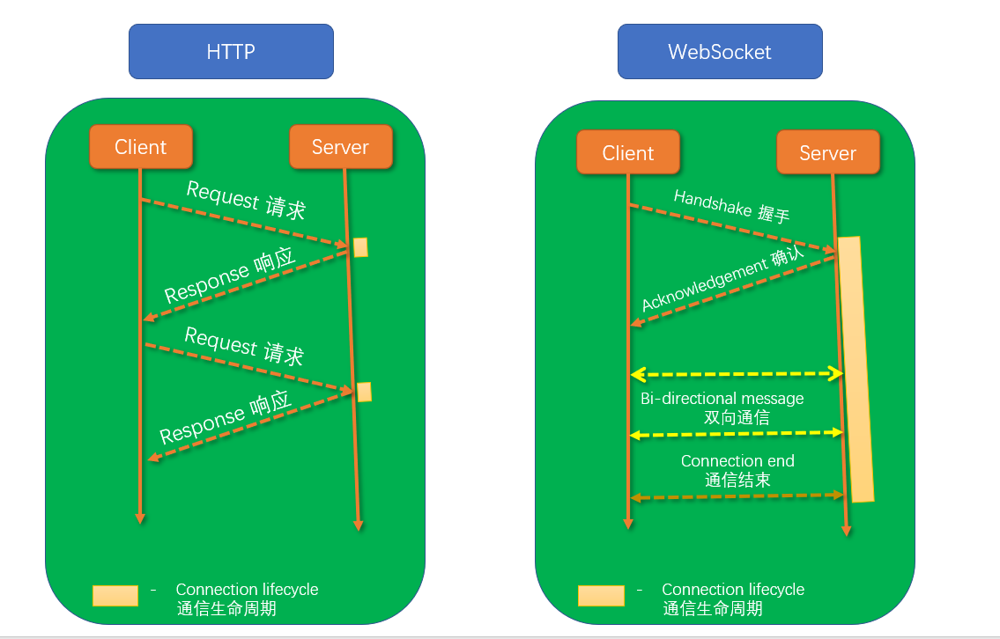

<!--
 * @Descripttion: 
 * @version: 
 * @Author: qiuxchao
 * @Date: 2022-07-15 11:18:27
 * @LastEditors: qiuxchao
 * @LastEditTime: 2022-07-21 20:03:37
-->
# Websockets

## 什么是 WebSockets ？

1. WebSockets 是一种在单个 TCP 连接上进行全双工通信的协议；
2. 双向数据传输，实现服务器和客户端真正的双向平等对话；
3. 可以创建持久性、实时性的连接

## 为什么需要 Websockets？

1. HTTP 协议有一个缺陷：通信只能由客户端发起；
2. HTTP 协议做不到服务器主动向客户端推送信息。

## HTTP & WebSocket 演示图

## WebSockets 的应用

1. 多人聊天系统
2. 多人浏览器游戏
3. 协同代码编辑
4. 实时新闻网站
5. 多用户的实时应用程序
6. ......
