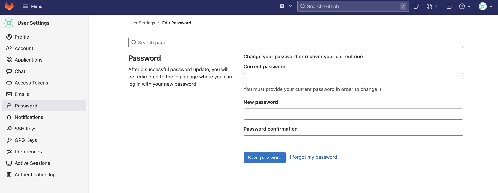

<!--
 * @Descripttion: 
 * @version: 
 * @Author: qiuxchao
 * @Date: 2022-07-04 16:40:12
 * @LastEditors: qiuxchao
 * @LastEditTime: 2022-07-27 16:01:00
-->
# GitLab

`GitLab`是一个开源的`git`仓库管理平台，方便团队协作开发、管理。在`GitLab上`可以实现完整的`CI`（持续集成）、`CD`（持续发布）流程。而且还提供了免费使用的`Plan`，以及免费的可以独立部署的社区版本[https://gitlab.com/gitlab-org/gitlab-ce](https://gitlab.com/gitlab-org/gitlab-ce )。

官网: [https://about.gitlab.com/](https://about.gitlab.com/)

## 安装

本文示例服务器环境为 `Centos 7.6`

### 1、安准基础依赖

``` shell
#安装技术依赖
sudo yum install -y curl policycoreutils-python openssh-server

#启动ssh服务&设置为开机启动
sudo systemctl enable sshd
sudo systemctl start sshd
```

### 2、安装Postfix

`Postfix`是一个邮件服务器，`GitLab`发送邮件需要用到

``` shell
#安装postfix
sudo yum install -y postfix

#启动postfix并设置为开机启动
sudo systemctl enable postfix
sudo systemctl start postfix
```

### 3、开放ssh以及http服务（80端口）

``` shell
#开放ssh、http服务
sudo firewall-cmd --add-service=ssh --permanent
sudo firewall-cmd --add-service=http --permanent

#重载防火墙规则
sudo firewall-cmd --reload
```

## 部署

本次我们部署的是社区版: `gitlab-ce`，如果要部署商业版可以把关键字替换为：`gitlab-ee`

### 1、Yum安装GitLab

添加`GitLab`社区版`Package`

``` shell
curl https://packages.gitlab.com/install/repositories/gitlab/gitlab-ce/script.rpm.sh | sudo bash
```

安装GitLab社区版

``` shell
sudo yum install -y gitlab-ce
```

安装成功后会看到 `gitlab-ce` 打印了以下图形


### 2、配置GitLab站点域名

`GitLab`默认的配置文件路径是 `/etc/gitlab/gitlab.rb`

默认的站点域名配置项是：

``` shell
external_url 'http://gitlab.example.com'
```

这里将`GitLab`站点域名修改为`http://**你的域名**`

也可以用`IP`代替域名，这里根据自己需求来即可

``` shell
#修改配置文件
sudo vi /etc/gitlab/gitlab.rb

#配置首页地址（大约在第15行）
external_url 'http://qiuxc.cn'
```

### 3、启动并访问GitLab

启动`GitLab`

``` shell
#重新配置并启动
sudo gitlab-ctl reconfigure

#完成后将会看到如下输出
Running handlers complete
Chef Client finished, 432/613 resources updated in 03 minutes 43 seconds
gitlab Reconfigured!
```

访问`GitLab`
将设置的域名`DNS`解析到服务器`IP`，或者修改本地`host`将域名指向服务器`IP`。
访问设置的域名即可验证`GitLab`是否配置成功


这里需要使用默认的 `root` 用户登陆，其默认密码保存在 `/etc/gitlab/initial_root_password`。使用默认密码登陆成功后，应进入个人信息页面修改密码



## 使用外置 Nginx & 配置域名

参考：[官方文档](https://docs.gitlab.com/omnibus/settings/nginx.html#using-an-existing-passengernginx-installation)

<!-- ## GitLab项目自动同步到GitHub或Gitee -->

> 参考链接🔗：<br/>
> [CentOS 7 下 GitLab安装部署教程](https://ken.io/note/centos7-gitlab-install-tutorial)<br/>
> [gitlab配置域名访问](https://blog.51cto.com/u_13767724/2390388)<br/>
> [gitlab项目自动同步到github或者码云gitee](https://developer.aliyun.com/article/644973)

## 卸载删除 GitLab

1. 停止 gitlab

  ```bash
  gitlab-ctl stop
  ```

2. 卸载 gitlab-ce

  ```bash
  rpm -e gitlab-ce
  ```

3. 查看 gitlab 进程

  ```bash
  $ ps aux | grep gitlab

  root      1453  0.0  0.0   4384   496 ?        Ss   Jul04   0:28 runsvdir -P /opt/gitlab/service log: ...........................................................................................................................................................................................................................................................................................................................................................................................................
  root      1488  0.0  0.0   4376   548 ?        S    Jul04   0:00 svlogd -tt /var/log/gitlab/logrotate
  root      1529  0.0  0.0   4376   540 ?        S    Jul04   0:00 svlogd -tt /var/log/gitlab/redis
  root      1576  0.0  0.0   4376   512 ?        S    Jul04   0:00 svlogd /var/log/gitlab/gitaly
  root      1721  0.0  0.0   4376   540 ?        S    Jul04   0:00 svlogd -tt /var/log/gitlab/postgresql
  root      1830  0.0  0.0   4232   444 ?        Ss   Jul04   0:00 runsv gitlab-kas
  root      1843  0.0  0.0   4376   540 ?        S    Jul04   0:00 svlogd -tt /var/log/gitlab/gitlab-kas
  root      2014  0.0  0.0   4376   516 ?        S    Jul04   0:05 svlogd /var/log/gitlab/sidekiq
  root      2025  0.0  0.0   4232   444 ?        Ss   Jul04   0:00 runsv gitlab-workhorse
  root      2051  0.0  0.0   4376   336 ?        S    Jul04   0:00 svlogd /var/log/gitlab/gitlab-workhorse
  root      2136  0.0  0.0   4376   544 ?        S    Jul04   0:00 svlogd -tt /var/log/gitlab/node-exporter
  root      2151  0.0  0.0   4232   356 ?        Ss   Jul04   0:00 runsv gitlab-exporter
  root      2162  0.0  0.0   4376   540 ?        S    Jul04   0:04 svlogd -tt /var/log/gitlab/gitlab-exporter
  root      2186  0.0  0.0   4376   540 ?        S    Jul04   0:00 svlogd -tt /var/log/gitlab/redis-exporter
  root      2217  0.0  0.0   4376   544 ?        S    Jul04   0:00 svlogd -tt /var/log/gitlab/prometheus
  root      2258  0.0  0.0   4376   540 ?        S    Jul04   0:00 svlogd -tt /var/log/gitlab/alertmanager
  root      2298  0.0  0.0   4376   540 ?        S    Jul04   0:17 svlogd -tt /var/log/gitlab/postgres-exporter
  root      2571  0.0  0.0   4376   540 ?        S    Jul04   0:00 svlogd -tt /var/log/gitlab/grafana
  root      7381  0.0  0.0   4376   556 ?        S    15:06   0:00 svlogd -tt /var/log/gitlab/puma
  root      7433  0.0  0.0   4376   556 ?        S    15:06   0:00 svlogd -tt /var/log/gitlab/nginx
  root     14383  0.0  0.0 112816   980 pts/0    S+   15:35   0:00 grep --color=auto gitlab
  ```

4. 杀掉第一个进程（就是带有好多…………. 的进程）

  ```bash
  kill -9 1453
  ```

  杀掉后，再 `ps aux | grep gitlab` 确认一遍，还有没有 gitlab 的进程

5. 删除所有包含 gitlab 文件

  ```bash
  find / -name gitlab | xargs rm -rf
  ```
