<!--
 * @Descripttion: 
 * @version: 
 * @Author: qiuxchao
 * @Date: 2022-07-07 15:41:48
 * @LastEditors: qiuxchao
 * @LastEditTime: 2022-07-27 16:17:00
-->
# Jenkins

Jenkins是一个开源的支持自动化构建、部署等任务的平台。基本上可以说是持续集成（CI）、持续发布（CD）不可或缺的工具。

官网： [https://jenkins.io/](https://jenkins.io/)

## 安装

- 本篇环境信息

| 工具/环境 | 版本 |
| -------- | ------- |
| Linux Server | CentOS 7.6 |
| Jenkins | 2.346.1 |
| JDK | 1.8.0_332 |
| Nginx | 1.22.0|

### 准备工作

1. 安装JDK
参考: [Centos7.5安装java8](https://www.jianshu.com/p/0dd37861a983)
2. 安装Nginx（非必要步骤）
参考: [https://qiuxc.cn/operation/nginx.html](https://qiuxc.cn/operation/nginx.html)

### Jenkins安装

#### Yum安装

1. yum源导入

``` shell
#添加Yum源
sudo wget -O /etc/yum.repos.d/jenkins.repo https://pkg.jenkins.io/redhat-stable/jenkins.repo --no-check-certificate

#导入密钥
sudo rpm --import https://pkg.jenkins.io/redhat-stable/jenkins.io.key
```

2. 安装

``` shell
sudo yum install -y jenkins
```

#### 开放防火墙端口

Jenkins站点的默认监听端口是8080

``` shell
sudo firewall-cmd --add-port=8080/tcp --permanent
sudo firewall-cmd --reload
```

#### 启动Jenkins并设置Jenkins开机启动

``` shell
#重载服务（由于前面修改了Jenkins启动脚本）
sudo systemctl daemon-reload

#启动Jenkins服务
sudo systemctl start jenkins

#将Jenkins服务设置为开机启动
#由于Jenkins不是Native Service，所以需要用chkconfig命令而不是systemctl命令
sudo /sbin/chkconfig jenkins on
```

浏览器输入 `http://<ip address>:8080` 访问Jenkins

### Nginx配置（非必要步骤）

#### 配置Nginx反向代理Jenkins

这里使用的是`https`，需要配置`443`端口，并且需要在域名服务商那里申请`ssl`证书，然后把证书上传到服务器并把路径填入下面的配置中

``` shell
#新增Jenkins专用Nginx配置文件
sudo vi /etc/nginx/conf.d/jenkins.conf

#输入以下内容并保存
server {
    listen       443 ssl;        #监听443端口
    server_name  jenkins.qiuxc.cn; #监听的域名
    access_log  /var/log/nginx/jenkins.access.log;
    error_log  /var/log/nginx/jenkins.error.log;
    
    ssl_certificate      /etc/nginx/server/ssl/jenkins.qiuxc.cn_nginx/jenkins.qiuxc.cn_bundle.crt;  #这是下载下来的nginx证书的crt文>件路径，绝对或者>相对路径都可以
    ssl_certificate_key  /etc/nginx/server/ssl/jenkins.qiuxc.cn_nginx/jenkins.qiuxc.cn.key;   #和crt的规则一样
    ssl_session_cache    shared:SSL:1m;
    ssl_session_timeout  5m;
    ssl_protocols TLSv1.2 TLSv1.3;
    ssl_ciphers  ECDHE-RSA-AES128-GCM-SHA256:HIGH:!aNULL:!MD5:!RC4:!DHE;
    ssl_prefer_server_ciphers  on;

    location / {            #转发或处理
        proxy_pass http://127.0.0.1:8080;
    }
    error_page   500 502 503 504  /50x.html;#错误页
    location = /50x.html {
        root   /usr/share/nginx/html;
    }
}
```

配置完 `nginx` 后重启

```shell
sudo systemctl restart nginx
```

然后即可通过域名访问：[https://jenkins.qiuxc.cn](https://jenkins.qiuxc.cn)

### Jenkins初始化

#### 解锁Jenkins

查询root账号默认密码

``` shell
cat /var/lib/jenkins/secrets/initialAdminPassword
```

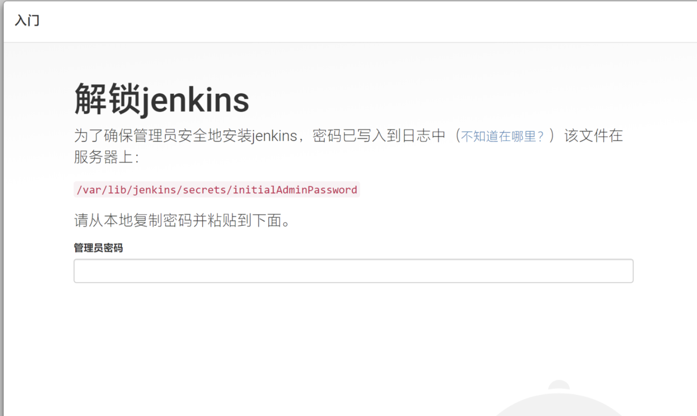
输入密码并继续

#### 选择插件

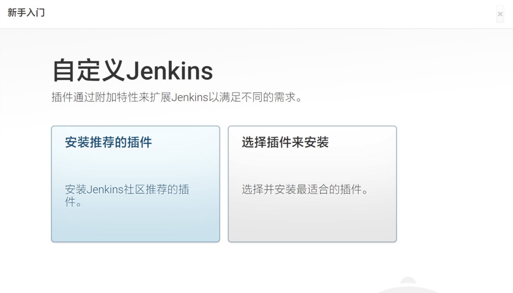
这里直接选择“安装推荐的插件”即可
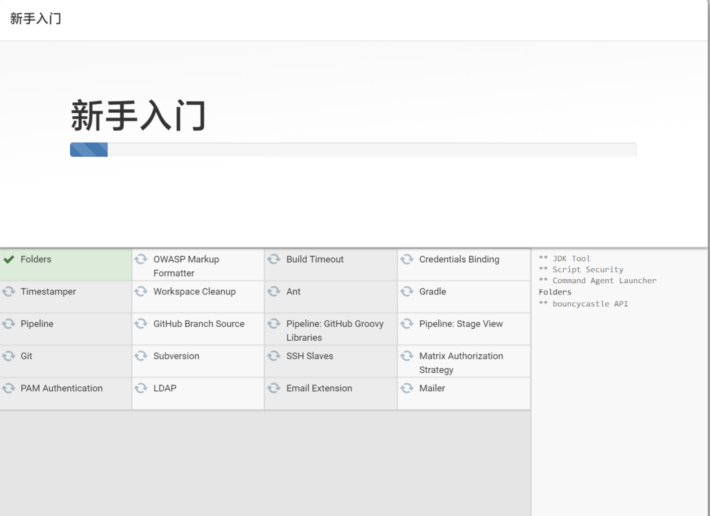

#### 添加管理员

插件安装完成后会自动进入添加管理员界面
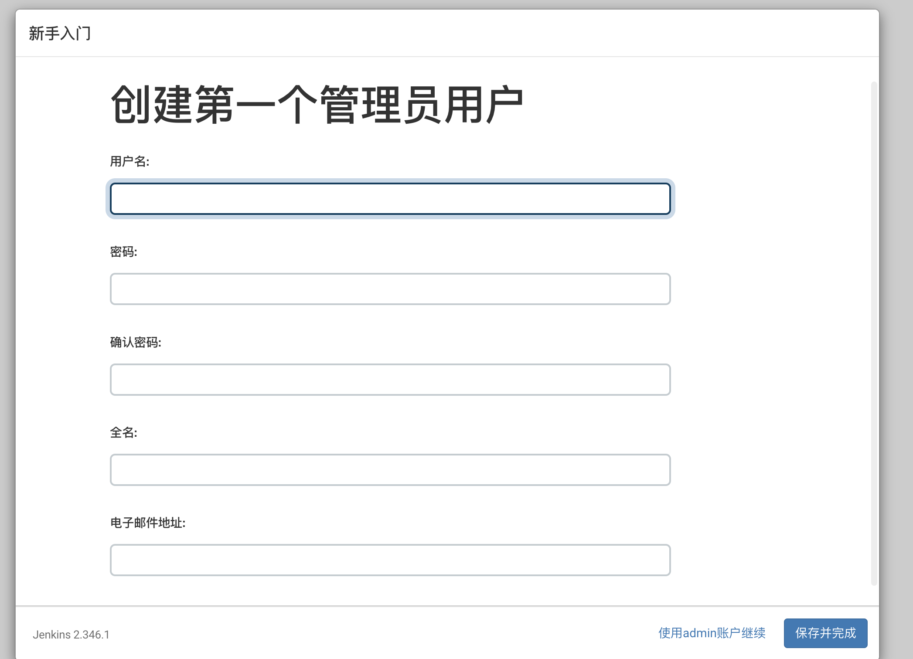

#### 配置Jenkins URL

这里的URL指的是默认访问`Jenkins`的地址。
默认是是<http://:8080>，如果你通过`Nginx`配置了域名，那么直接填写配置的域名即可
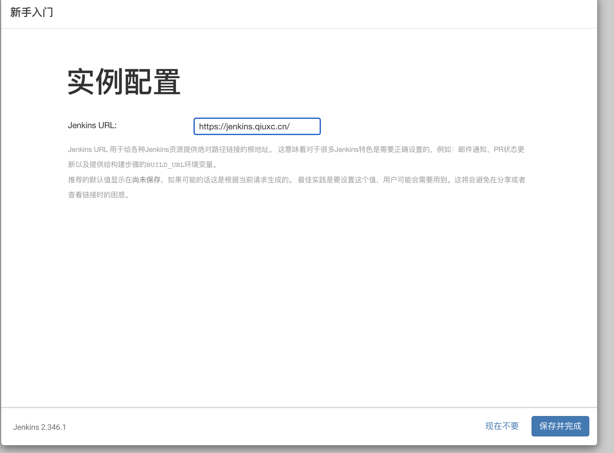

#### 开始使用Jenkins

配置完`Jenkins URL`之后就完成了整个`Jenkins`配置引导
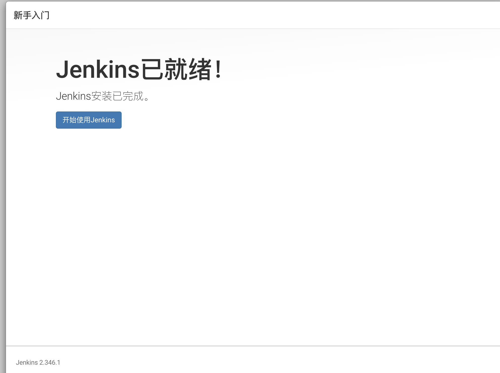

点击“开始使用Jenkins”就会进入`Jenkins`主页
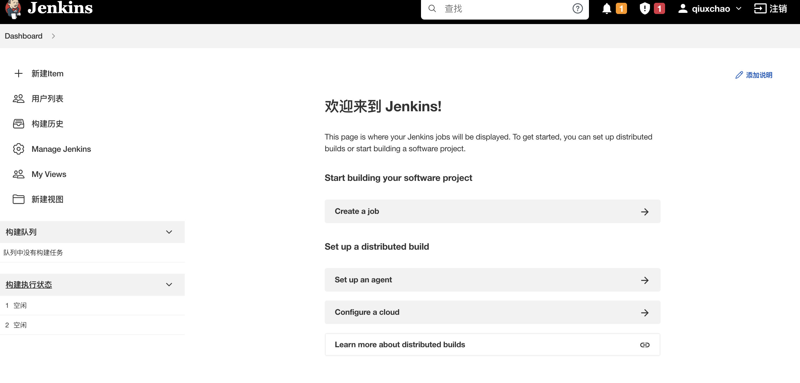

大功告成～

> 本章参考🔗：[CentOS 7 下Jenkins安装部署教程](https://ken.io/note/centos7-jenkins-install-tutorial)

## 配置 Jenkins 与 GitHub Webhook 集成

持续集成 (CI) 是软件开发的 DevOps（开发和运营）实践，因为它在快节奏的环境中自动执行测试、开发和部署过程。企业使用 DevOps 来优化他们的开发和部署流程。要在项目中实现持续集成，我们需要将 SCM（源代码控制管理）工具与 `CI` 工具集成。

`Jenkins` 是一个开源 `CI` 工具，许多开发人员使用它来自动化其应用程序的测试和部署。`Jenkins` 与 `GitHub Webhook` 集成让开发人员可以节省时间并始终保持项目更新。`GitHub` 是广泛使用的用于版本控制的 `SCM` 工具之一，它允许开发人员与全球其他开发人员协作。

`Jenkins` 与 `GitHub Webhook` 集成用于在开发人员将某些内容提交到存储库时触发操作。如果没有检测到错误，它可以自动编译或部署应用程序。在本文中，我们将设置 `Jenkins` 与 `GitHub Webhook` 集成的步骤。还将了解 `Jenkins` 与 `GitHub Webhook` 集成的好处以及它如何帮助开发人员自动化任务。

### 准备工作

开始配置前，我们需要先修改 `Jenkins` 全局配置中 `Git` 的部分：

- 进入 `Jenkins` 主页，点击侧边栏的 `Manage Jenkins` 按钮
    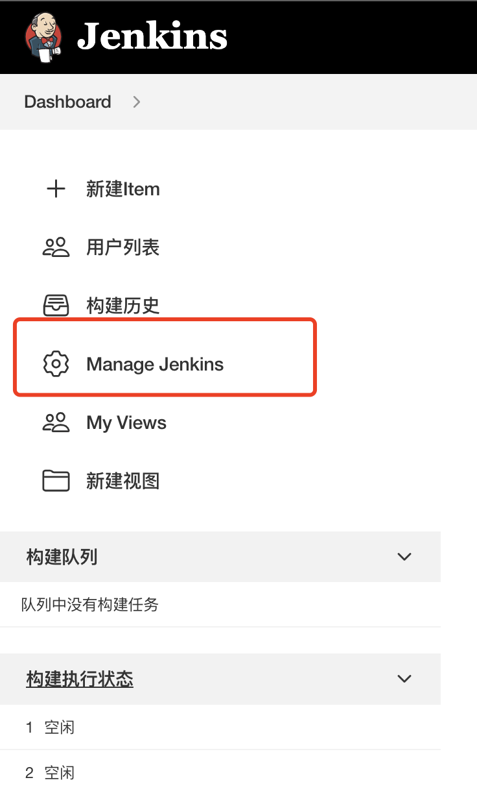

- 在打开的页面中 `System Configuration` 下点击 `Global Tool Configuration` 选项
    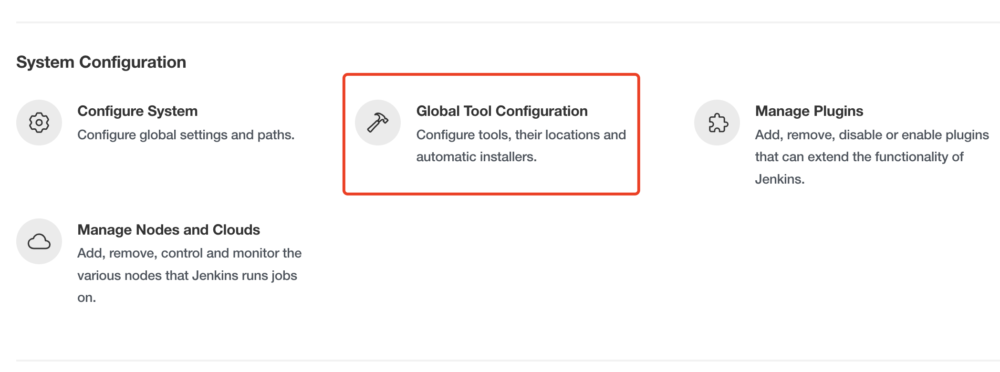

- 在打开的页面 `Global Tool Configuration` 中找到 `Git` 配置
  - `Name`：`GitHub` 用户名
  - `Path to Git executable`：`Git`安装路径（Linux命令:which git、windows 命令: where git）
    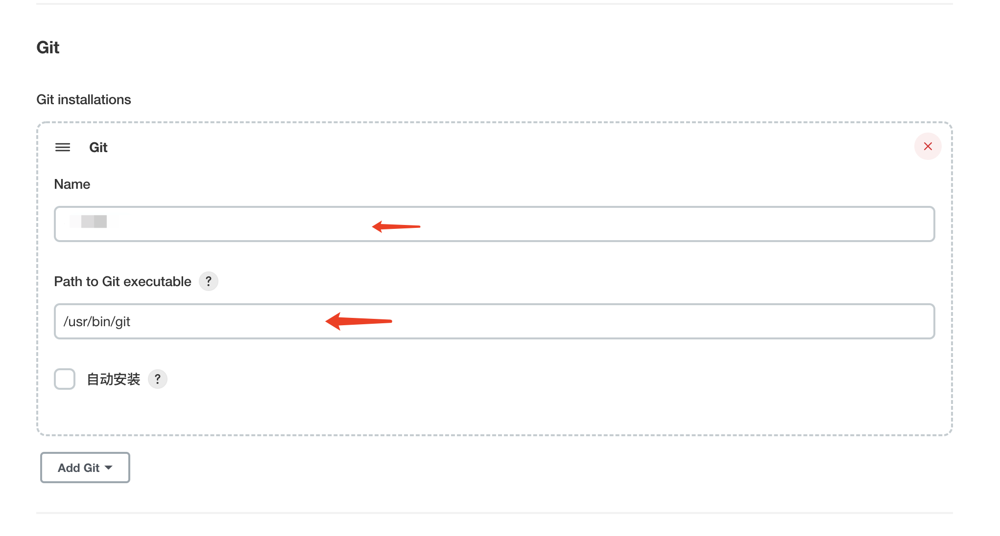

配置完 `Git` 路径后，还需要创建与 `Github` 互联的凭证（用户名密码或者ssh key）：

- 进入 `Jenkins` 主页，点击侧边栏的 `Manage Jenkins` 按钮
    

- 点击 `Manage Credentials` 凭据管理
    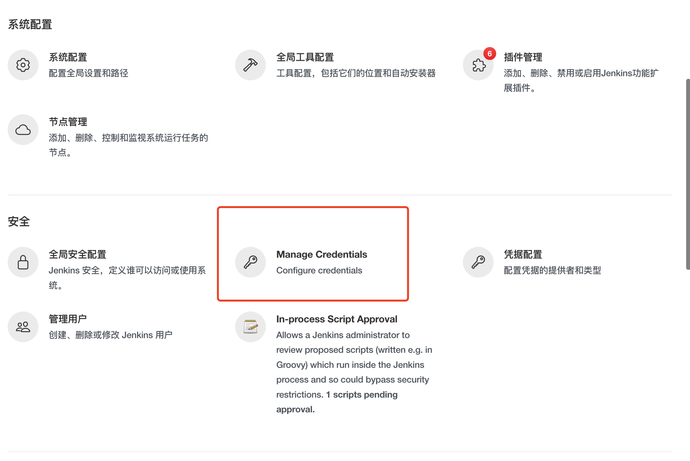

- 点击 `Jenkins`
    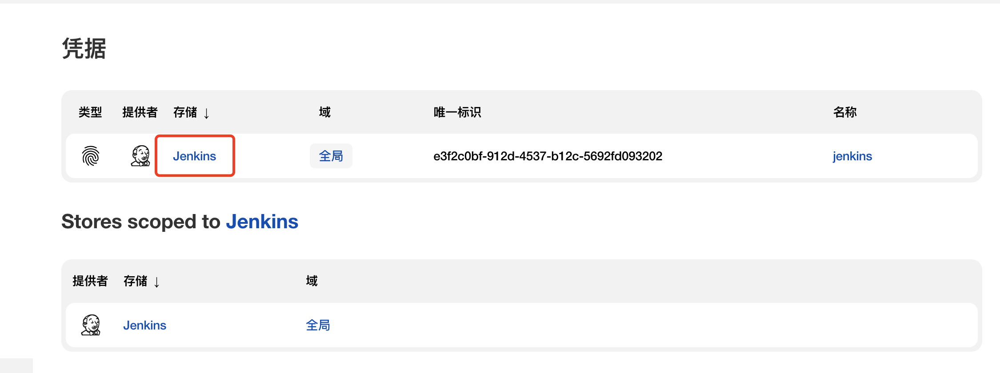

- 点击 `添加凭据`
    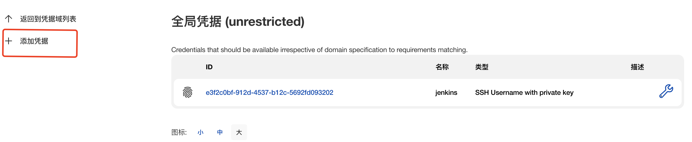

- 这里可以配置不同类型的连接到`GitHub`的凭据，我这里配置的是 `ssh key`，将服务器 `~/.ssh/id_rsa` 文件内容粘贴到下面的位置点击 `Create`
    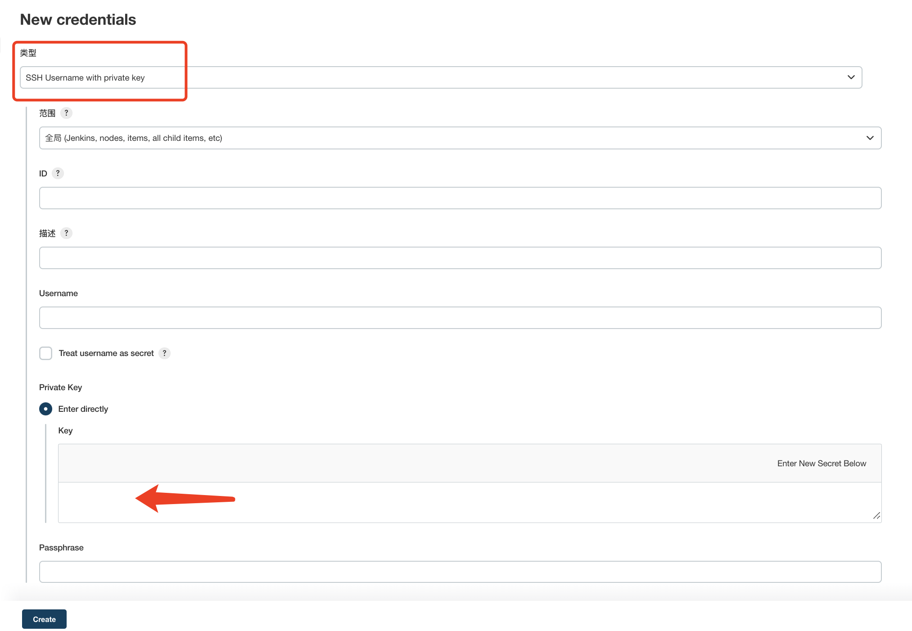

- 大功告成！我们配置了 `Git` 路径和 `GitHub ssh key`

::: warning
如果不配置上面的步骤，则会出现

``` shell
ERROR: Timeout after 10 minutes
ERROR: Error cloning remote repo 'origin'
```

:::

下面开始为 `Github` 项目配置 `Jenkins`

### 第 1 步：为 GitHub 配置 Jenkins

- 登录 `Jenkins`，进入到 `Jenkins` 项目面板，点击左侧边栏中的「**配置**」
    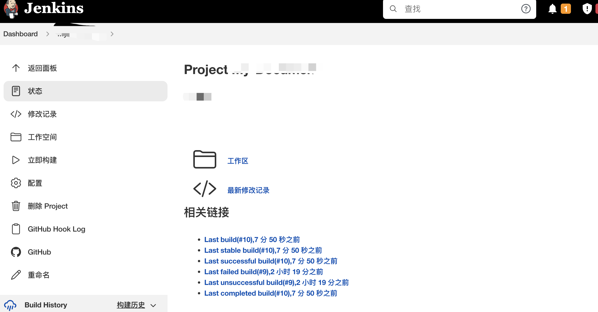

- 进入配置页面，勾选「**GitHub 项目**」，然后填入 `github` 项目地址
    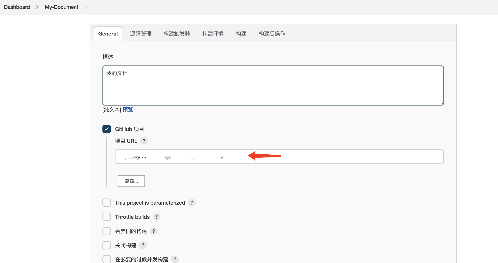

- 点击「**源码管理**」选项卡，同样填入 `github` 项目地址，然后在点击下面的「**添加**」按钮，在浮窗中选择 `Jenkins`
    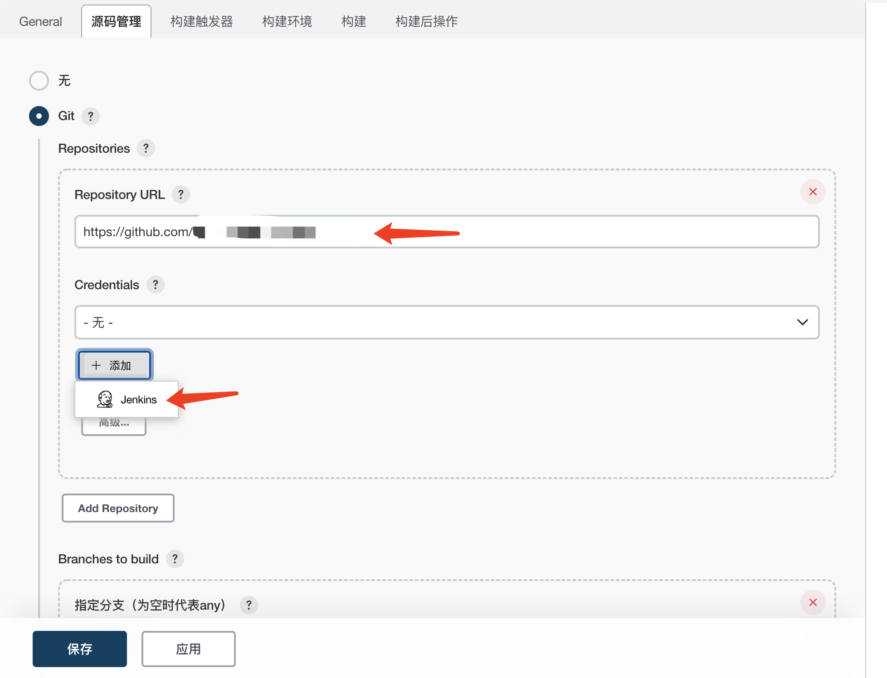

- 点击「**构建触发器**」选项卡，选择 `GitHub hook trigger for GITScm pull` 选项，它将监听来自给定 `GitHub` 存储库的触发器
    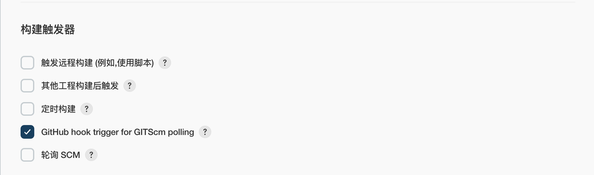

- 现在，单击页面底部的「**应用**」按钮以保存更改并为我们的 `Github` 存储库创建一个 `Jenkins` 项目

### 第 2 步：设置 GitHub Webhook

- 进入到 `Github` 项目的设置页面，点击侧边栏的 `Webhooks`，然后点击 `Add webhook` 按钮
    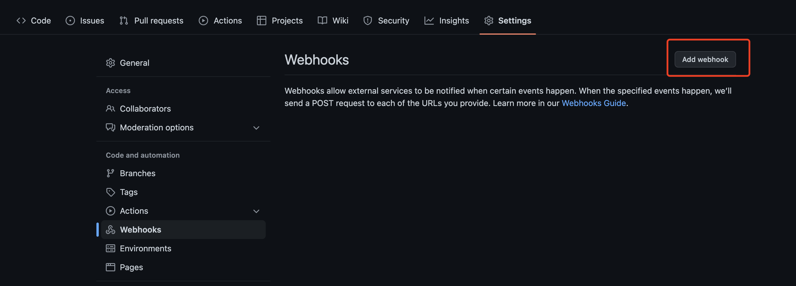

- 复制 `Jenkins` 的主页地址，然后将其粘贴到 `Payload URL` 输入框中，在地址的末尾附加 `/github-webhook/`, 选择 `Content type` 为 `application/json` 格式, 如下图所示:
    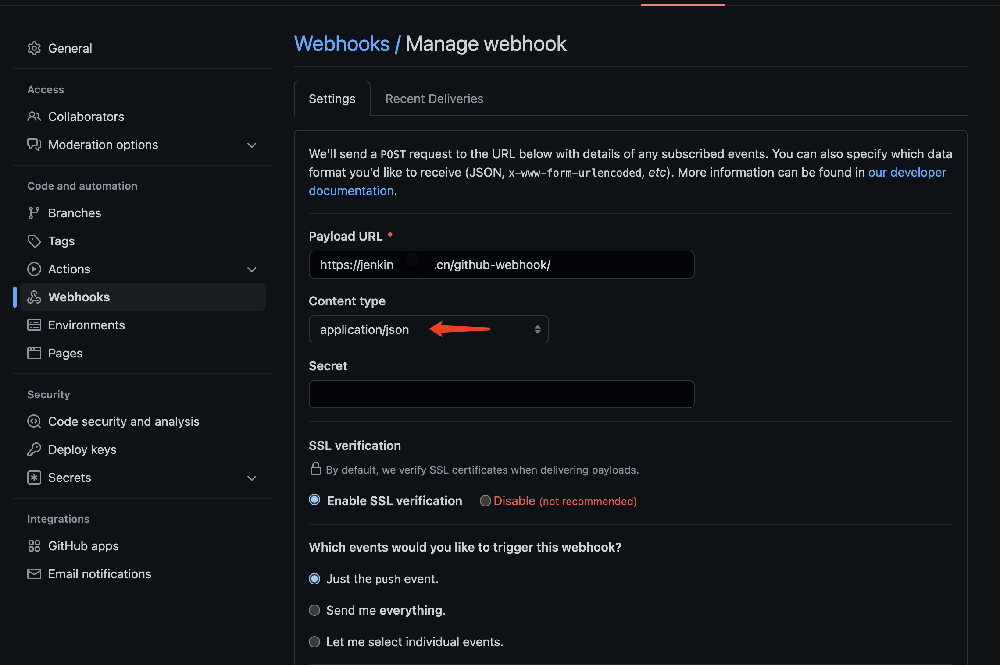

- `Secret` 字段是可选的，我们留空即可
- 接下来，在 `Which events would you like to trigger this webhook?` 下选择一个选项。这3个选项将执行下列事件：
  - `Just the push event.`：它只会在有人推送到存储库时发送数据。
  - `Send me everything.`：如果有任何将事件拉入或推送到存储库中，它将触发。
  - `Let me select individual events.`：您可以配置您想要数据的事件。
  
- 现在，单击 `Add webhook` 按钮以保存配置。

至此！我们完成了 `Jenkins` 与 `GitHub Webhook` 集成。现在对于 `GitHub` 存储库中的任何提交，`Jenkins` 将触发指定的事件。

### 踩坑记录

1. 运行 `Jenkins` 构建中 `shell` 脚本出现：`rm: cannot remove xxx: Permission denied`
    出现这种情况是 `Jenkins` 权限不足导致的，解决办法：

    - 将`jenkins`没有权限的目录转让给`jenkins`

    ``` shell
    chown -R jenkins /www 
    ```
