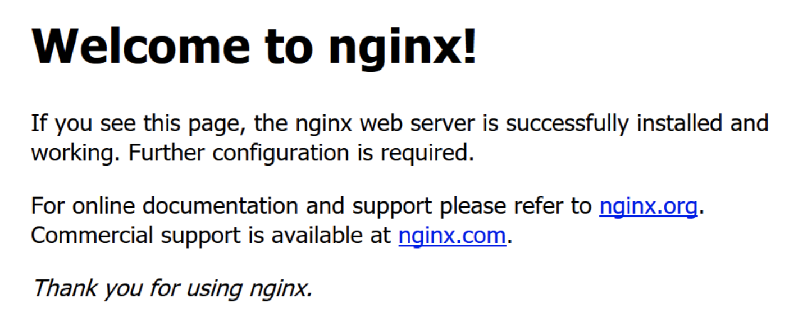

<!--
 * @Descripttion: 
 * @version: 
 * @Author: qiuxchao
 * @Date: 2022-06-27 10:12:13
 * @LastEditors: qiuxchao
 * @LastEditTime: 2022-07-27 14:39:09
-->
# Nginx

## 安装&配置

### Nginx 安装

1. 添加RPM包进行安装

``` shell
#添加Nginx包
sudo rpm -Uvh http://nginx.org/packages/centos/7/noarch/RPMS/nginx-release-centos-7-0.el7.ngx.noarch.rpm

#安装
sudo yum -y install nginx
```

2. 启动Nginx并设置为开机启动

``` shell
#启动服务
sudo systemctl start nginx
#（如果启动失败，可能是Apache等服务占用了80端口，关掉相应服务/修改端口即可）

#设置nginx开机启动
sudo systemctl enable nginx
```

3. 开放端口

``` shell
#开放80端口（nginx默认监听80端口）
firewall-cmd --add-port=80/tcp --permanent

#重载防火墙规则
firewall-cmd --reload
```

4. 访问测试
  浏览器输入 服务器IP，出现以下信息说明安装成功
  

### Nginx 常用配置

#### 配置文件

``` shell
1、全局配置文件：/etc/nginx/nginx.conf
2、默认配置文件：/etc/nginx/conf.d/default.conf
```

新增配置目录

``` shell
#1、新增配置文件夹
sudo mkdir /etc/nginx/server
#2、修改默认配置（加载该文件夹下的配置）
sudo vi /etc/nginx/nginx.conf
#3、在http属性下增加：
include /etc/nginx/server/*.conf;
```

#### 反向代理配置

``` shell
#1、新建/修改配置文件
sudo vi /etc/nginx/server/default.conf

#2、配置示例
server {
    listen       80;        #监听80端口
    server_name  qiuxc.cn; #监听的域名
    location / {            #转发或处理
        proxy_pass https://qiuxc.cn;
    }
    error_page   500 502 503 504  /50x.html;#错误页
    location = /50x.html {
        root   /usr/share/nginx/html;
    }
}
```

#### 负载均衡配置

``` shell
upstream serverswitch {
    server 127.0.0.1:80;
    server 127.0.0.1:81;
}
server {
    listen       80;        #监听80端口
    server_name   qiuxc.cn; #监听的域名
    location / {            #转发或处理
        proxy_pass https://serverswitch;
    }
    error_page   500 502 503 504  /50x.html;#错误页
    location = /50x.html {
        root   /usr/share/nginx/html;
    }
}
```

## SSL 证书安装部署

[腾讯云 `SSL` 证书安装部署操作步骤](https://cloud.tencent.com/document/product/400/35244)
