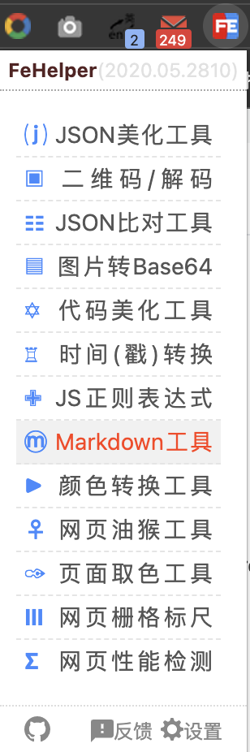
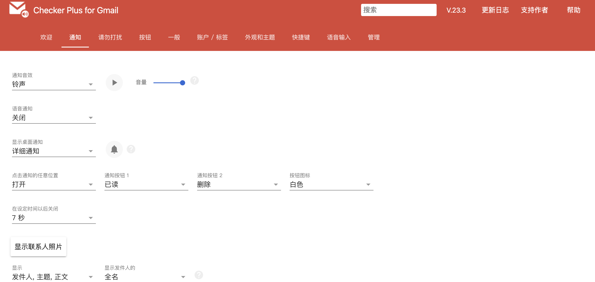
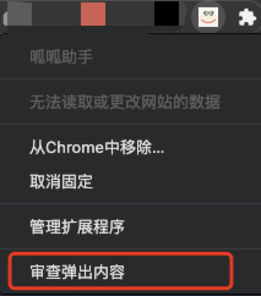
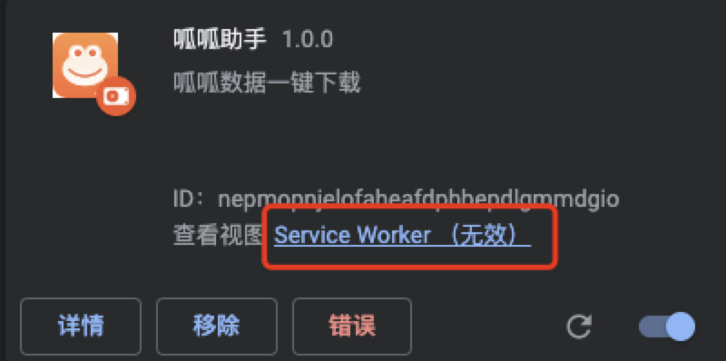
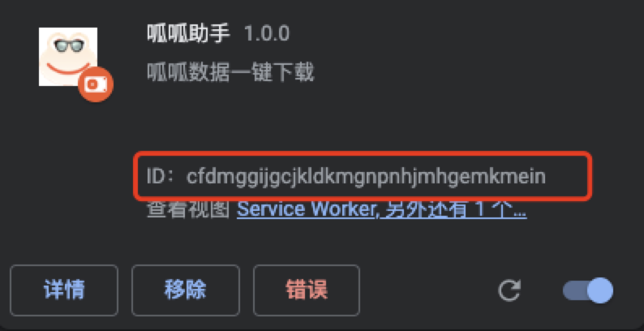

# Chrome 扩展开发入门

Chrome扩展是用于扩充Chrome浏览器功能的程序。主要是对浏览器功能的增强，它更强调与浏览器相结合。比如Chrome扩展可以更改用户当前浏览的网页中的内容、获取Devtools中的信息、更改浏览器代理服务器的设置等等。

Chrome扩展是一系列文件的集合，这些文件包括**HTML文件**、**CSS样式文件**、**JavaScript脚本文件**、**图片等静态文件**以及 `manifest.json` 清单文件。

## 扩展程序基本组成结构


扩展程序是通过『内容脚本』『浮层』『后台脚本』『devtools信息』等合作通信去实现特定功能的后台程序。

### manifest.json

扩展被安装后，Chrome就会读取扩展中的 `manifest.json` 文件。这个文件的文件名固定为 `manifest.json`，内容是按照一定格式描述的扩展相关信息，如扩展名称、版本、更新地址、请求的权限、扩展的UI界面入口等等。这样Chrome就可以知道在浏览器中如何呈现这个扩展，以及这个扩展如何同用户进行交互。

自2022年1月17日起，Chrome 网上应用商店已停止接受新的 Manifest V2 扩展。Manifest V2 将于 2024 年逐步淘汰。

Manifest V3 扩展在安全性、隐私和性能方面得到增强，因此后续我们将使用最新的 V3 版本。

下面仅列举部分配置，完整配置清单见官方：[📃 https://developer.chrome.com/docs/extensions/mv3/manifest/](https://developer.chrome.com/docs/extensions/mv3/manifest/)

```json
  {
  // 基本信息
  "manifest_version": 3,  // V3 版本
  "name": "My Extension",  // 插件名称
  "version": "1.0.1",  // 插件版本
  "description": "A plain text description", // 插件描述
  "default_locale": "en",  // 默认语言
  "author": "xxx",  // 插件作者

   // 用于配置点击插件图标后的浮层，popup.html 则是浮层的内容
  "action": {
     "default_title": "Click to view a popup",  // 鼠标移动到扩展图标时显示 tooltip
   	 "default_popup": "popup.html"
   },

  "icons": {...},  // 插件图标配置

  // `后台脚本`，该脚本不能访问DOM，只能通过 `消息传递` 与扩展程序的其他部分进行通信，例如：`内容脚本`、`浮层`
  "background": {
    "service_worker": "background.js",
  },

  // `内容脚本`，在网页中运行，可以访问DOM、获取页面上下文以及向页面中插入内容，通过 `消息传递` 与扩展程序的其他部分进行通信
  "content_scripts": [
     {
       "matches": ["https://*.nytimes.com/*"],  // 指定此内容脚本被插入到哪些页面中
       "css": ["my-styles.css"],  // 要注入匹配页面的 CSS 文件列表
       "js": ["content-script.js"],  // 要注入匹配页面的 JavaScript 文件列表，按照数组的顺序注入（不支持网络路径）
       "run_at": "document_idle", // 何时将 JavaScript 文件注入网页，可选址值：document_idle document_start document_end
     }
   ],

  // 使用/添加devtools中的功能
  "devtools_page": "devtools.html",

  // 插件设置页面
  "options_page": "options.html",
  "options_ui": {
    "chrome_style": true,
    "page": "options.html"
  },

  // 该插件可以访问的资源，后台脚本发送跨域请求需要配置该项
  "host_permissions": ["http://*/*", "https://*/*"],

  // 必需权限，扩展程序的基本功能所需的权限。 权限列表：https://developer.chrome.com/docs/extensions/mv2/declare_permissions/
  "permissions": ["storage"],

  // 可选权限，与 permissions 类似，但在扩展运行时授予，而不是提前授予
  "optional_permissions": ["downloads"]
  
}
```

### 浮层(popup)

点击插件图标后出现的浮层，`popup.html` 则是浮层的内容，可以在 `popup.html` 中引入JS文件，以用于与扩展其他部分进行交互。



```json
{
  "name": "My Extension",

  "action": {
     "default_title": "Click to view a popup",
   	 "default_popup": "popup.html"
   },
}
```

> [📃 action](https://developer.chrome.com/docs/extensions/reference/action/)


### 后台脚本(service_worker)

扩展程序使用 `service_worker` **后台脚本**来监视**扩展程序的其他部分注册的事件**，然后根据指定的指令做出反应。

`service_worker` 后台脚本的特性：

- 无法访问页面 `DOM`。

- 会一直处于休眠状态，直到它们正在侦听的事件触发，按照指定的指令做出反应，然后卸载。

- 可以发送跨域请求。

> [📃 service_worker](https://developer.chrome.com/docs/extensions/mv3/service_workers/)

#### 注册 service_worker

在 `manifest.json` 清单文件的 `background` 字段配置一个JS文件以指定后台脚本：

```json
{
  "name": "Awesome Test Extension",
  ...
  "background": {
    "service_worker": "background.js"
  },
  ...
}
```

还可以选择指定一个额外的字段，`"type": "module"` 以让 `service_worker` 支持 `ES` 模块，这允许我们使用 `import`。例如：

```json
 "background": {
    "service_worker": "background.js",
    "type": "module"
  }
```

有关更多信息，参阅 [ES modules in service workers](https://web.dev/es-modules-in-sw/)

#### 初始化扩展

监听到 `chrome.runtime.onInstalled` 事件触发时表明插件安装完成。可以使用此事件设置状态或一次性初始化，例如设置右键菜单：

```js
chrome.runtime.onInstalled.addListener(() => {
  chrome.contextMenus.create({
    "id": "sampleContextMenu",
    "title": "Sample Context Menu",
    "contexts": ["selection"]
  });
});
```


### 内容脚本(content_script)

**内容脚本**是在网页上下文中运行的文件。通过使用标准文档对象模型(DOM)，他们能够读取浏览器访问的网页的详细信息(DOM)，对其进行更改，并将信息传递给扩展的其他部分。

此外，**内容脚本**只可以访问部分 chrome API：

- i18n
- storage
- runtime:
  - connect
  - getManifest
  - getURL
  - id
  - onConnect
  - onMessage
  - sendMessage

**内容脚本**可以通过使用 `message API` 来与扩展的其他部分进行通信。

> [📃 content_script](https://developer.chrome.com/docs/extensions/mv3/content_scripts/)

#### 注入方式

内容脚本可以**静态声明**或以**编程方式**注入。

##### 使用静态声明注入

`manifest.json` 中的 `content_scripts` 字段声明用于应该在目标页面上自动运行的脚本。

```json
{
 "name": "My extension",
 ...
 "content_scripts": [
   {
     "matches": ["https://*.nytimes.com/*"],
     "css": ["my-styles.css"],
     "js": ["content-script.js"]
   }
 ],
 ...
}
```

##### 以编程方式注入

对需要在特定场合运行的**内容脚本**使用编程注入。

要以编程方式注入内容脚本，扩展程序要有 `activeTab` 权限，具体配置：

manifest.json:
```json
{
  "name": "My extension",
  ...
  "permissions": [
    "activeTab" // 声明 activeTab 权限
  ],
  "background": {
    "service_worker": "background.js"
  }
}
```

content-script.js:
```js
// 修改页面背景色
document.body.style.backgroundColor = 'orange';
```

background.js:
```js
chrome.action.onClicked.addListener((tab) => {
  // 点击扩展图标时动态注入内容脚本
  chrome.scripting.executeScript({
    target: { tabId: tab.id },
    files: ['content-script.js']
  });
});
```

或者函数体也可以作为内容脚本注入和执行：

background.js:
```js
function injectedFunction() {
  document.body.style.backgroundColor = 'orange';
}

chrome.action.onClicked.addListener((tab) => {
  // 点击扩展图标时动态注入内容脚本
  chrome.scripting.executeScript({
    target: { tabId: tab.id },
    // 直接运行函数
    func: injectedFunction
  });
});
```


### 配置页面(options_page)

提供配置页面来允许用户自定义扩展程序的功能。

几种跳转到扩展程序配置页面的方法：

- 通过 **右键单击工具栏** 中的扩展程序图标然后选择 **选项**；
- 导航栏输入 `chrome://extensions` 跳转到扩展程序管理页面，然后点击目标扩展程序的「详情」-「扩展程序选项」；
- 在扩展程序内调用 `chrome.runtime.openOptionsPage()` API。



> [📃 options_page](https://developer.chrome.com/docs/extensions/mv3/options/)

### DevTools(devtools_page)

扩展程序的 DevTools 为 Chrome DevTools 添加了功能。它可以添加新的 UI 面板和侧边栏，与唤出 `DevTools` 的页面交互（打开F12的页面），获取有关网络请求的信息等等。DevTools 扩展可以访问一组额外的 DevTools 特定扩展 API：

- `devtools.inspectedWindow` 获取**被检查页面**的选项卡ID、上下文代码、获取页面内的资源列表。
- `devtools.network` 检索网络面板中开发者工具显示的网络请求信息。
- `devtools.panels` 将的扩展的 `DevTools` 集成到开发人员工具窗口 UI 中：创建自己的面板、访问现有面板并添加侧边栏。

Devtools 在扩展程序架构中的体现：


> [📃 DevTools](https://developer.chrome.com/docs/extensions/mv3/devtools/)

## 消息传递

由于**内容脚本**(content_script)在网页上下文而不是扩展程序的上下文中运行，因此它们通常需要某种方式与扩展程序的其余部分进行通信。 

**内容脚本**和扩展程序其他部分的通信通过使用**消息传递**进行。任何一方都可以侦听从另一端发送的消息，并在同一通道上响应。消息可以包含任何有效的 JSON 对象（null, boolean, number, string, array, object）。

有一个用于**一次性请求**的API和一个**建立长期连接**API（它允许在共享上下文中交换多条消息的长连接。如果知道另一个扩展的ID，也可以向另一个扩展发送消息）。

> [📃 消息传递](https://developer.chrome.com/docs/extensions/mv3/messaging/)

#### 一次性请求

如果只需要向扩展程序的另一部分(内容脚本或后台脚本)发送一条消息（并且可以选择返回响应），应该使用简化的 `runtime.sendMessage` 或 `tabs.sendMessage`。这可以将一次性 JSON 可序列化消息从**内容脚本**发送到**后台脚本**或其他部分，反之亦然。可选的回调参数允许我们处理来自另一侧的响应（如果有）。

从内容脚本发送请求如下所示：

```js
chrome.runtime.sendMessage({greeting: "hello"}, function(response) {
  console.log(response.farewell);
});
```

在接收端，需要设置一个 `runtime.onMessage` 事件侦听器来处理消息：

```js
chrome.runtime.onMessage.addListener(
  function(request, sender, sendResponse) {
    // 有 sender.tab 说明是从 内容脚本 发过来的，否则就是从其他部分发过来的
    console.log(sender.tab ?
                "from a content script:" + sender.tab.url :
                "from the extension");
    if (request.greeting === "hello")
      sendResponse({farewell: "goodbye"});
  }
);
```

从**扩展程序其他部分**向**内容脚本**发送请求看起来非常相似，只是需要指定将请求发送到哪个选项卡：

```js
chrome.tabs.query({active: true, currentWindow: true}, function(tabs) {
  // 向当前浏览器窗口正在激活的 tab 页面发送消息
  chrome.tabs.sendMessage(tabs[0].id, {greeting: "hello"}, function(response) {
    console.log(response.farewell);
  });
});
```

#### 长期连接

有时，我们可能需求建立一个长会话。在这种情况下，可以使用 `runtime.connect` 或 `tabs.connect` 打开一个从内容脚本到**其他部分**的长期通道，反之亦然。通道可以有一个可选的名称，允许我们区分不同类型的连接。

> 有关建立长连接的更多信息，参阅：[长期连接](https://developer.chrome.com/docs/extensions/mv3/messaging/#connect)


## 开发调试

- `popup` 右键扩展图标，选择**审查弹出内容**，会弹出控制台



- `service_worker` 有一个专属的控制台，可以在那里查看打印信息



- `content_script` 直接在页面控制台查看信息

- `devtools` 在此页面打开F12进行调试 `chrome-extension://{扩展ID}/devtools/index.html`，扩展ID查看：


  
或者在【扩展管理】-【详情】-【查看视图】找到对应扩展的调试窗口地址。


## 项目实践-呱呱助手

功能点：

- 商品详情页面一键下载商品图片
- 商品列表页面一键发送列表数据到服务端接口
- 从商品列表批量下载商品详情的图片

使用到的Chrome扩展能力：

- `storage` 存储
- `message API` 消息通信
- `optional_permissions` 配置 `downloads` 可选权限，用到时请求
- `devtools.network` 获取网络请求
- `host_permissions` 配置支持后台脚本发送跨域请求

### 踩坑记录

### 无法为内容脚本加载 JavaScript“”。 无法加载清单。

出现此错误可能有多种原因，一般都是 `manifest.json` 中的配置项有问题，可以排查下列属性：

- `content_scripts` 中的js不能使用网络路径
- `default_locale` 配置为 `zh_CN` 后需要在根目录下新建 `_locales` 语言包目录
- 将需要在外部使用的资源列到 `web_accessible_resources` 属性中


### Unchecked runtime.lastError: This function must be called during a user gesture

- 未经检查的 runtime.lastError：必须在用户手势期间调用此函数

由脚本自动触发的动态获取权限，而不是由用户的点击事件触发，解决办法：

- 将动态权限改成固定权限。

### Unchecked runtime.lastError: The message port closed before a response was received.

- 未经检查的 runtime.lastError：消息端口在收到响应之前关闭

这种问题是在调用 `chrome.runtime.sendMessage` 时添加了回调，但是在接受消息端没有调用回传消息方法导致的：

```js
// 发送端
chrome.runtime.sendMessage({
    action: "server",
    source: "test",
}, function(response){
    alert(response.text);
});

// 接收端
chrome.extension.onMessage.addListener(
  function (request, sender, sendResponse) {
    if (request.action === "server") {
      console.log(request);
      // 这里不调用 sendResponse 回传消息
    }
  }
);
```

解决办法：

- 发送端去掉回调方法或者接收端调用回调方法。

### Extension context invalidated

- 扩展上下文无效

当在扩展管理中心刷新或更新了某扩展，然后切换到浏览器某标签页的页面中直接使用该扩展时，扩展可能报错 `Extension context invalidated`。

报错位置可能在 `devtools/index.js` 里的 `"chrome.runtime.sendMessage()"` 部分。

处理方式：

1. 在更新了扩展后，使用扩展前，首先刷新相关页面
2. 使用 `chrome.runtime.id` 判断扩展上下文是否有效，然后再执行 `chrome.runtime.sendMessage()`
```js
chrome.runtime?.id && chrome.runtime.sendMessage()
```

### devtools 中使用 `chrome.devtools.network.onRequestFinished.addListener` 获取不到网络请求

不要直接打开 devtools 面板刷新页面，要刷新页面后再打开 devtools 面板再请求接口。

## 发布扩展

- 发布到 Chrome 应用商店（需要$5注册费），地址：[https://chrome.google.com/webstore/devconsole](https://chrome.google.com/webstore/devconsole)

- 在【扩展管理】页面打包本地的扩展程序，将打包出来的 `.crx` 文件拖入 Chrome 即可安装。
  > 但是现在 Chrome 已经不允许使用未在 Chrome 应用商店中发布的扩展程序，安装后会提示 *该扩展程序未列在 Chrome 应用商店中，并可能是在您不知情的情况下添加的。* 参阅：[Chrome 停用的扩展程序](https://support.google.com/chrome_webstore/answer/2811969?visit_id=638048013328104701-2621356661&p=ui_remove_non_cws_extensions&hl=zh-Hans&rd=2)


> 本文参考：
> 🔗 [Chrome 扩展程序官方文档](https://developer.chrome.com/docs/extensions/mv3/)
> 🔗 [最新版 V3 chrome 插件开发~ demo + 坑](https://juejin.cn/post/7021072232461893639#heading-8)