<!--
 * @Descripttion: 
 * @version: 
 * @Author: qiuxchao
 * @Date: 2022-05-23 11:10:24
 * @LastEditors: qiuxchao
 * @LastEditTime: 2022-07-27 14:38:07
-->
# Gitlab MR 结合钉钉机器人的自动化 Code Review

## 背景🔅

在团队中，大家的技术能力、经验都是有差异的。通过Code Review，对于同样的功能实现，有经验的工程师可以给经验尚浅的工程师提供合理的优化建议。经验尚浅的工程师可以通过阅读优质代码，快速学习相关技术运用的最佳实践。如果大家技术实力相当，就是互相刷新思想了。

### 场景

- 新人前几次开发完成需求时
- 重要的功能模块开发完成时
- ......

### Code Review 的好处👍

- 提前发现问题
  > 问题暴露的越晚，风险也就越大。Code Review 至少能提前发现流程或者实现上的问题。
- 提升代码质量
  > 没有人Review的代码，其代码水准就是写代码人的水准，而被一个团队Review过的代码，它的水准将接近甚至超过整个团队的最高水准。
- 经验和知识的传递
- ......

## GitLab Code Review📌

GitLab可以在分支合并的时候支持两种方式：

1. 在本地将源分支(Source branch)代码合并到目标分支（Target branch）然后`Push`到目标分支（Target branch）
2. 将源分支(Source branch)`Push`到远端，然后在GitLab指定目标分支（Target branch）发起`Merge Request`(简称MR)，对目标分支（Target branch）拥有`Push`权限的用户执行`Merge`操作，完成合并。

### GitLab Code Review 配置

#### 工作流

我们当前的工作流如下
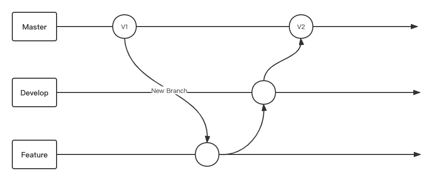

1. 需求确认后开发人员从`develop/master`分支创建自己的`feature`分支进行开发
2. 需求开发完成后，需要从最新`develop`分支合并到自己的`feature`分支，然后发布到测试环境进行测试
3. `feature`分支测试通过后合并到`develop`分支，等待班车上线
4. `develop`分支合并到`master`分支并发布到生产环境

#### Code Review 时机

以上述Git工作流为例，开发人员在`Feature`分支进行开发，开发完成后仍然在`Feature`分支进行测试。

基于当前的工作流，为了保证提测质量，我们可以在提测之前发起`Feature`到`Develop`分支的`Merge Request`，代码审查完成并且通过测试后将`Feature`分支合并到`Develop`分支.
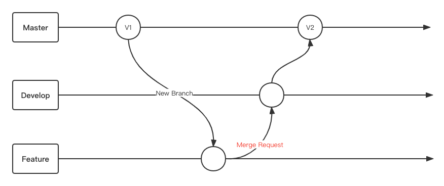

### GitLab Code Review 流程

Code Review 中至少应有两种角色：

- `developer` (开发者)
- `reviewer` (审查者)

Code Review 流程：

1. 变更 `feature` 分支，并将其 `push` 到远程分支（developer）
2. 在 `Gitlab` 页面上创建 **`Merge Request`**（developer）
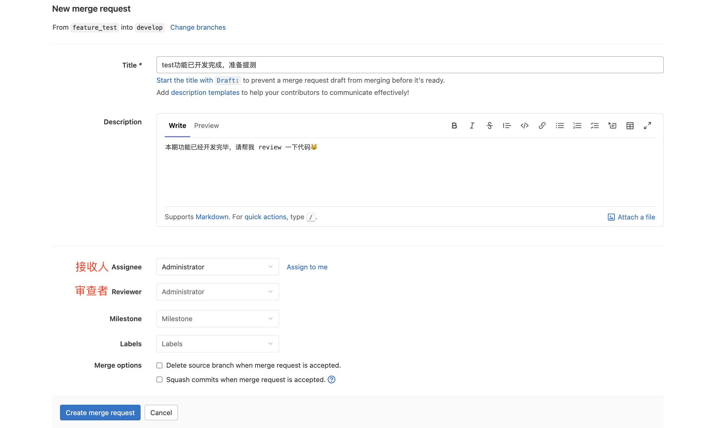
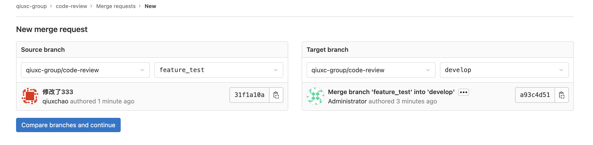
3. 审查代码 (reviewer)
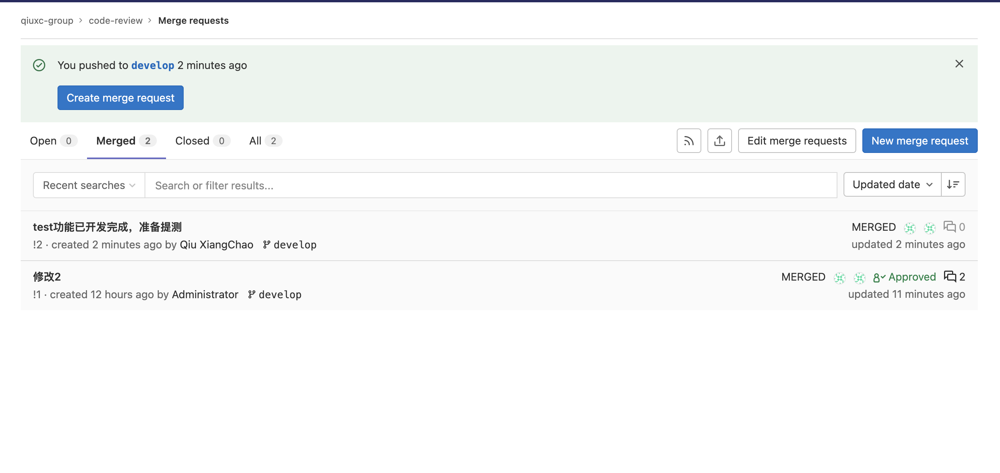
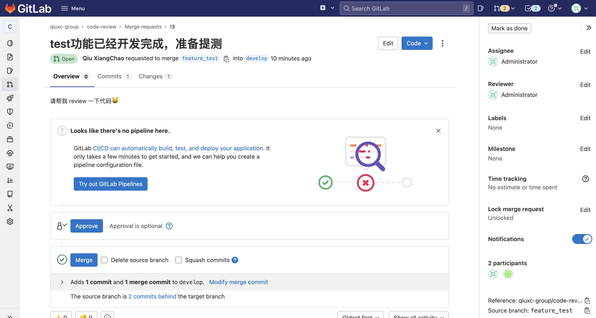
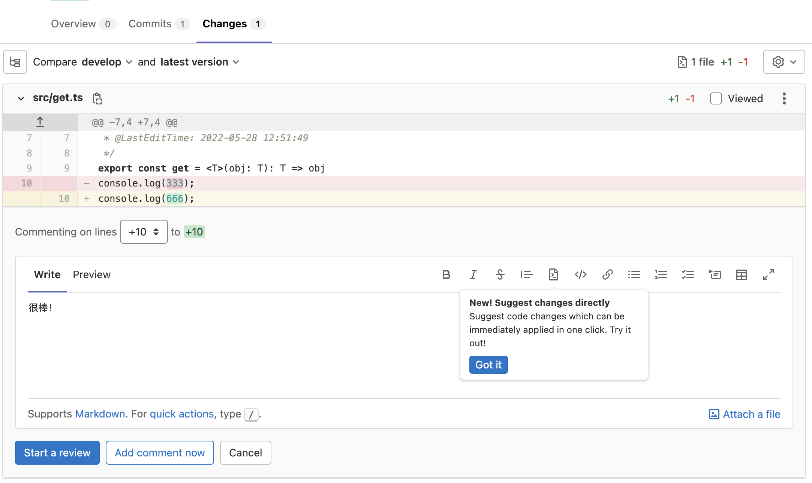
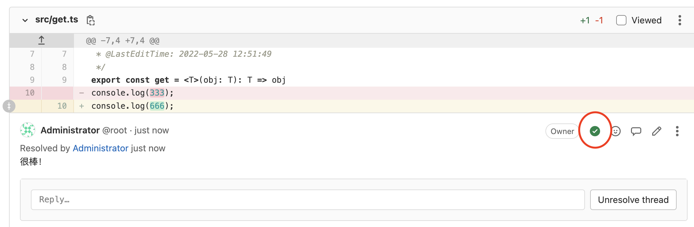
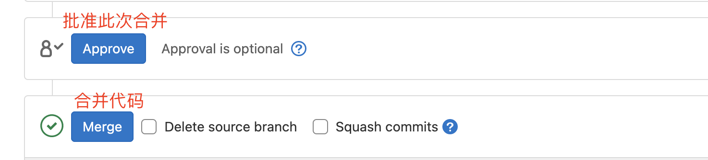

上面的流程存在的问题：

1. `Review` 过程中所有的操作都需要口头告知对应`developer/reviewer`
2. 创建`MR`过程比较繁琐，需要填写的信息过多

## 钉钉机器人🤖️

在钉钉，机器人是独立存在的一个应用类型，可以开箱即用，也可以进行二次开发，主要用来推送微应用的通知和用来对用户进行对话式服务。

官方文档：[https://open.dingtalk.com/document/robots/robot-overview](https://open.dingtalk.com/document/robots/robot-overview)

### Gitlab 机器人

使用钉钉群自带的 `gitlab` 机器人结合 `gitlab webhook` 实现 `merge request` 消息通知：
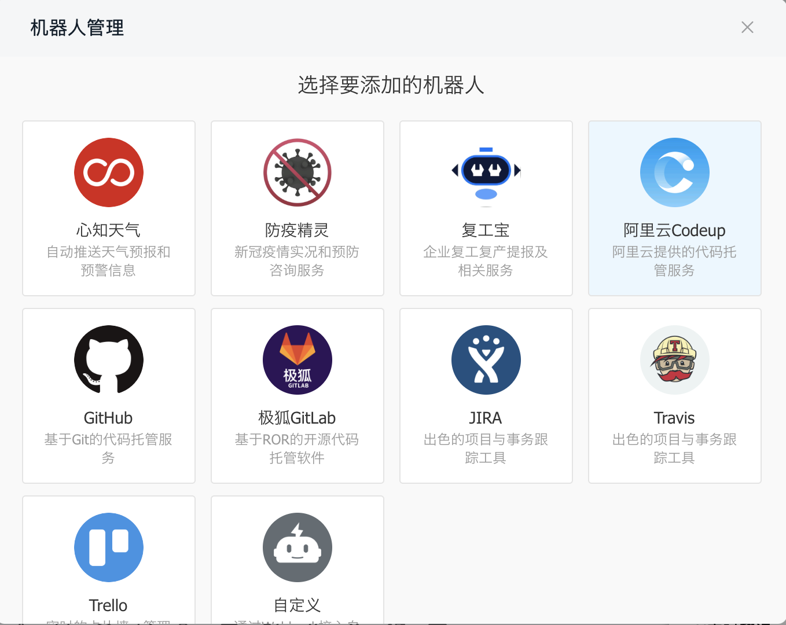
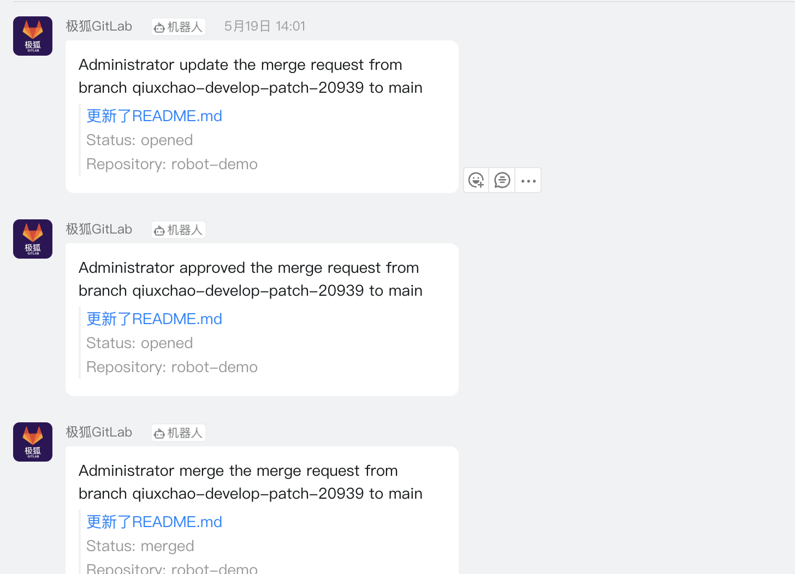
这种方式可以做到简单的群消息通知，而想要做到更具体的通知（比如 @ 参与此次 Review 的成员），则需要用到自定义机器人

### 自定义机器人

`GitLab` 上的操作，之所以能够把消息推送到对应钉钉群，本质上是借助于 `Webhooks` 和钉钉群消息机器人的能力，其流程如下图所示:
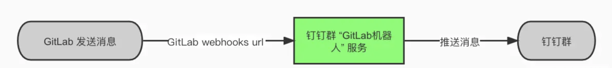

上述流程中，给钉钉群推送什么样格式的消息是由钉钉群"GitLab机器人"服务来做的，那么如果要自定义推送到钉钉群的消息内容，只需要替换掉钉钉群”GitLab机器人“的默认服务即可，流程图如下所示:

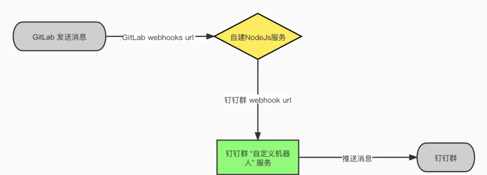

使用自定义机器人需要自建`Nodejs`服务，具体实现流程如下：

1. 钉钉群创建自定义机器人，得到推送消息`url`
2. 创建 `Nodejs` 服务器，暴露一个接口给 `Gitlab Webhook`
3. 编写接口逻辑，处理 `Gitlab Webhook` 发送过来的请求
4. 拼接好要发送到钉钉群的消息，向自定义机器人`url`发送请求

### 自定义机器人结合 GitLab MR 的 Code Review 🛠

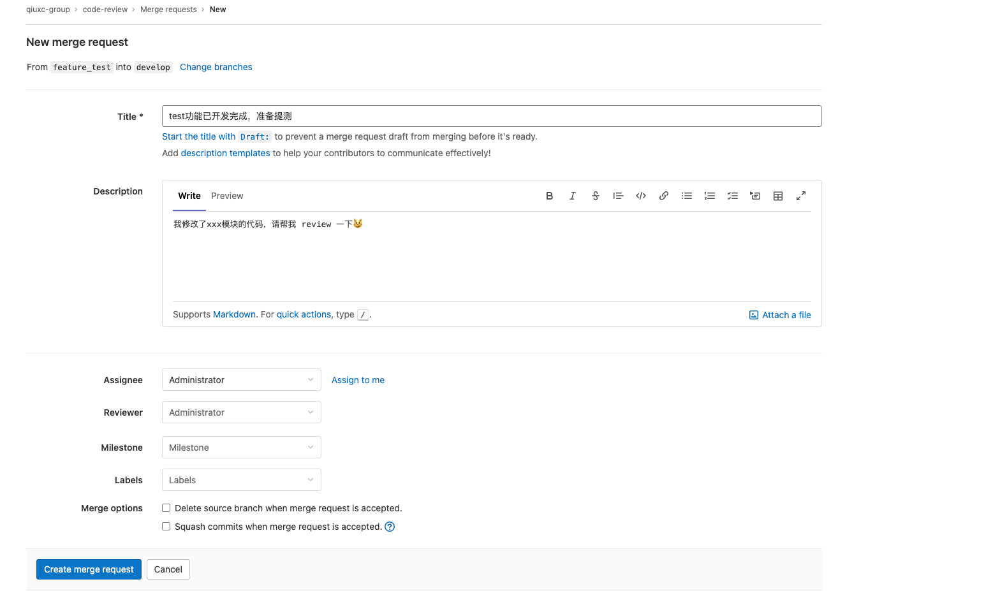
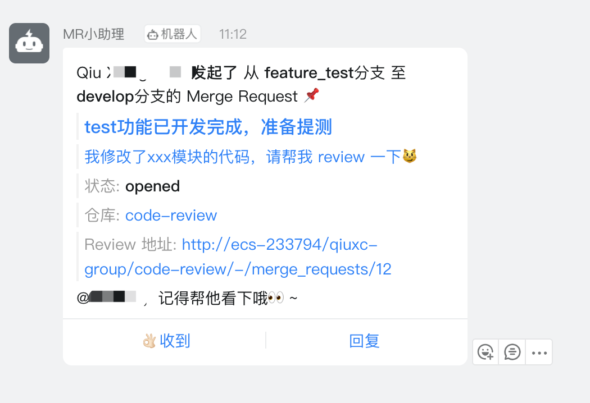

## NodeJs 脚本创建 MR 📝

为了进一步缩短 `Code Review` 链路，便有了以下诉求：

- 能否不登陆到 `Gitlab` 网页，在本地就可以创建 `MR`？

`GitLab`提供了丰富的`API`供我们使用，让我们可以无需登陆到`GitLab`页面就可以进行一些操作。API地址为 `gitlab地址/help/api/README.md`

其中就包括创建 `MR` 的`API`，基于此`API`便可以编写`NodeJs`脚本，在命令行交互式的创建`MR`，让我们能在编辑器控制台创建`MR`，整个流程看起来像这样：

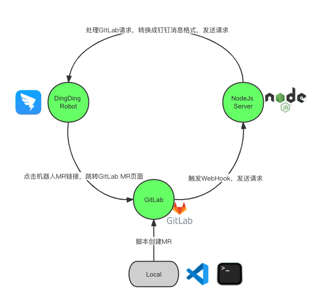

1. 在本地编辑器或命令行运行脚本，交互式创建`MR`
2. `GitLab`接收到创建`MR`请求，创建`MR`后触发`WebHook`发送请求到`Nodejs`服务
3. `Nodejs`服务处理`GitLab`请求，转换成钉钉机器人需要的格式，发送请求给钉钉机器人`Webhook`
4. 钉钉收到请求，将消息发送到群聊，`Code Review`成员点击`MR`链接进入到`GitLab MR`页面，开始此次代码审查
5. `Code Review` 中对`MR`的更新、审批、评论等操作都将触发`GitLab Webhook`，形成闭环

### 创建 Access Token

基本`GitLab`的鉴权机制，使用脚本前需要先在`GitLab`中创建自己的 `access token`，用于让`GitLab`验证我们的身份。

可以通过多种方式进行身份验证：

- OAuth2 tokens
- Personal access tokens
- Project access tokens

创建个人访问令牌（Personal access tokens）即可，创建流程如下：

1. 进入到`GitLab`中的用户设置页面
  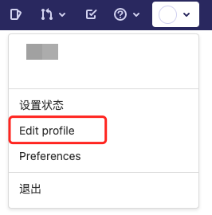
2. 创建个人访问令牌（Personal access tokens）
  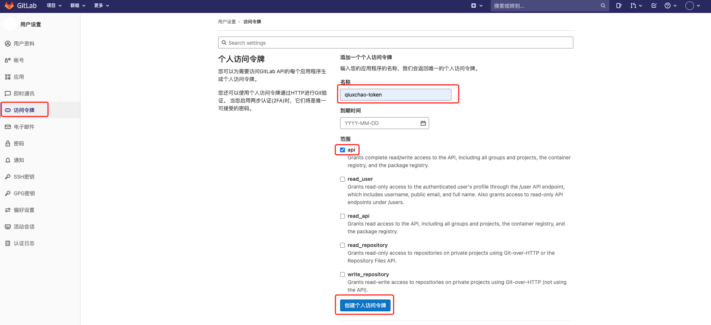

将创建好的`access token`填入到脚本中，脚本路径为：`bin/create_mr.js`

  ```javascript
  const ACCESS_TOKEN = '你的token';
  ```

### 使用脚本

命令行输入：`npm run create:mr`

根据提示输入MR标题、描述，然后选择reviewer即可

## ------

> 本文参考链接🔗：<br/>
> [如何在团队中做好Code Review](https://ken.io/note/how-to-do-code-review-in-a-team)<br/>
> [基于GitLab的Code Review教程](https://ken.io/note/gitlab-code-review-tutorial#H3-6)<br/>
> [GitLab merge request 结合钉钉群消息机器人的全自动 Code Review 实践](https://juejin.cn/column/7066714281068199972)
