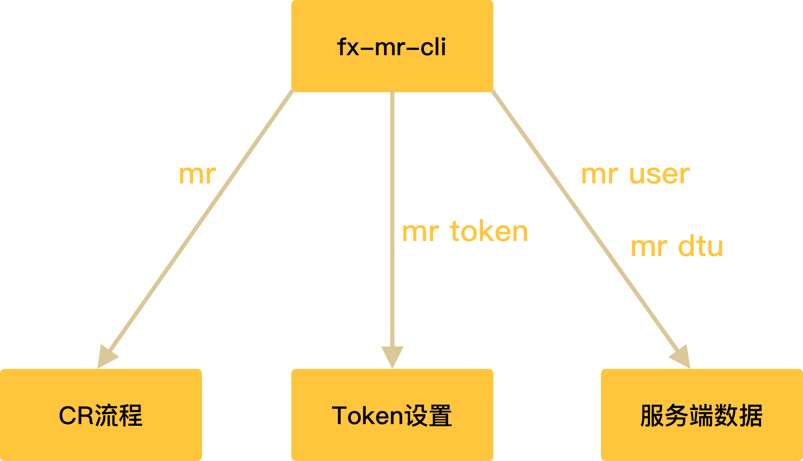
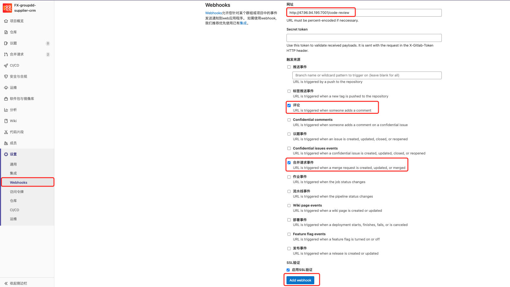

# Code Review 2.0

Code Review 1.0 中存在的问题：

- 只在小程序项目中配置了 `mr` 脚本，不支持其它项目，如要支持其它项目需拷贝代码，扩展性差；
- 脚本中所有人的 `GitLab Token` 都暴露出来，安全性差；
- 服务端的数据（用户数据、机器人地址数据）都需要手动修改代码来维护。

2.0 解决问题：

- 将原来的 `mr` 脚本编写成命令行工具 `npm` 包，实现一次安装多处使用 👍；
- 只用在安装 `mr` 包时配置一次 `GitLab Token`，且存储在用户本地，便捷性、安全性 🆙；
- 提供与服务端交互的子命令，可以直接在前端维护服务端数据 🔨。



> [🔗 mr工具使用文档](https://fenxianglife.yuque.com/technical-team/front/qpy4io)

## 接入CR流程

### 配置 GitLab Webhook

配置指定项目的 GitLab Webhook 后，后续在该项目中进行的MR或评论操作都将推送到钉钉群中。

在 `GitLab` 指定的项目下配置 `Webhook`，勾选「评论事件(Note Events)」和「合并请求事件(Merge Requests Events)」，地址为：`http://47.96.94.195:7001/code-review`



### 安装 fx-mr-cli 命令行工具包

`fx-mr-cli` 是一个 GitLab Merge Request 命令行工具，能够帮助我们在命令行中交互式创建 Merge Reqeust。

全局安装 `fx-mr-cli` npm包，具体安装及使用参考：[fx-mr-cli 命令行工具使用教程](https://fenxianglife.yuque.com/technical-team/front/qpy4io)

## 前端实现

- 借助 `yargs` 库来编写命令行工具

- 将项目编写成 `npm` 包，发布在公司私有仓库上

> [🔗 fx-mr-cli 项目地址](https://gitlab.fenxianglife.com/baseFE/FX-mr-cli)
### yargs 命令行解析库

`yargs` 是一个命令行参数解析库，可以帮助我们快速构建一个命令行程序。类似功能的库还有 `commander`、`meow`。

> [🔗 yargs 官方文档](http://yargs.js.org/docs/)

#### option 选项

通过 `option` 方法，可以自定义选项，例如默认的查看版本号和查看帮助菜单：

```sh
$ mr -h
$ mr -v
```

> [🔗 option 使用方法](http://yargs.js.org/docs/#api-reference-optionkey-opt)

#### command 子命令

通过 `command` 方法，可以设置 `Git` 风格的子命令:

```sh
$ mr token
$ mr user
$ mr dtu
```

> [🔗 command 使用方法](http://yargs.js.org/docs/#api-reference-commandcmd-desc-builder-handler)


### npm 发包

`npm` 规定需要将可执行的命令放在 `bin` 目录下，所以我们的目录结构为：

```sh
.
├── bin
│   ├── mr
│   ├── create.js
│   └── ...
├── utils
└── package.json
```

还需在 `package.json` 稍作配置：

```json
{
  ...
  "bin": {
    "mr": "bin/mr"
  },
  "files": [
    "bin",
    "utils"
  ],
  "publishConfig": {
    "registry": "http://nexus.fenxianglife.com/repository/npm-private"
  },
  ...
}

```

运行 `npm publish` 即可将当前 `bin`、`utils` 中的文件打包上传至 `npm` 仓库

## 服务端实现

服务端按照 `egg` 的规范对代码进行了重构，使其便于维护。

> [🔗 服务端项目地址](https://gitlab.fenxianglife.com/baseFE/FX-review-server)

### egg 基础功能

- `Router` 路由。暴露给前端的接口，指向对应的 `Controller`
- `Controller` 控制器。解析前端的请求，处理后返回相应的结果
- `Service` 服务。编写业务逻辑，供 `Controller` 调用
- `Middleware` 中间件。类似于拦截器

### 远程数据维护

- 将数据存储在 `json` 文件中

- 暴露接口出去，用于对 `json` 文件中的数据进行增删改查

### token 校验中间件

将前端传过来的 `token` 传给 `GitLab`，验证用户是否存在，标识 `token` 是否有效。