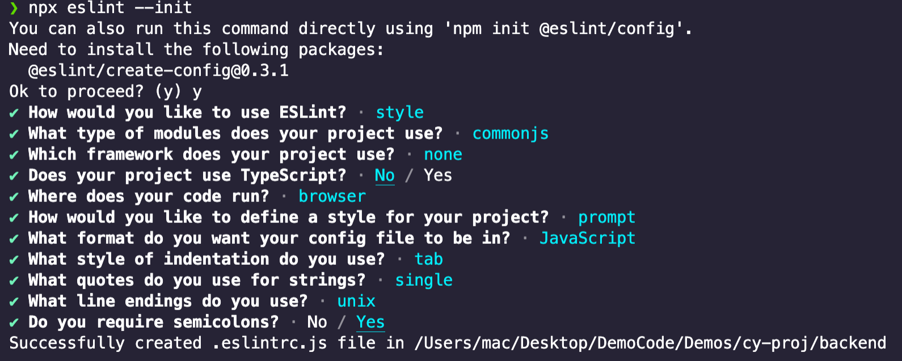

# EsLint

ESLint 是在 ECMAScript/JavaScript 代码中识别和报告模式匹配的工具，它的目标是保证代码的一致性和避免错误。在许多方面，它和 JSLint、JSHint 相似，除了少数的例外：

- ESLint 使用 [Espree](https://github.com/eslint/espree) 解析 JavaScript。
- ESLint 使用 AST 去分析代码中的模式
- ESLint 是完全插件化的。每一个规则都是一个插件并且你可以在运行时添加更多的规则。

> 配置 EsLint 前，确保 VsCode 已经安装了 EsLint 插件。

## 安装 & 使用 EsLint

先决条件：Node.js (>=6.14), npm version 3+。

1. 使用 yarn 或者 npm 安装 EsLint:

```sh
# yarn
yarn add eslint -D

# npm
$ npm install eslint --save-dev
```

2. 生成配置文件，在项目命令行中输入：

```sh
npx eslint --init
```

3. 根据提示交互式的生成配置文件：



配置文件会在项目根目录下生成，名为 `.eslintrc.js`

4. 可以根据需要修改配置文件，参考文档：[EsLint 配置文件](https://cn.eslint.org/docs/user-guide/configuring)

## 规则配置

运行 `eslint --init` 之后，`.eslintrc` 文件会在你的文件夹中自动创建。你可以在 `.eslintrc` 文件中看到许多像这样的规则：

```json
{
    "rules": {
        "semi": ["error", "always"],
        "quotes": ["error", "double"]
    }
}
```

`"semi"` 和 `"quotes"` 是 ESLint 中 [规则](https://cn.eslint.org/docs/rules/) 的名称。第一个值是错误级别，可以使下面的值之一：

- `"off"` or `0` - 关闭规则
- `"warn"` or `1` - 将规则视为一个警告（不会影响退出码）
- `"error"` or `2` - 将规则视为一个错误 (退出码为1)

这三个错误级别可以允许你细粒度的控制 ESLint 是如何应用规则（更多关于配置选项和细节的问题，请查看[配置文件](https://cn.eslint.org/docs/user-guide/configuring)）

你的 `.eslintrc` 配置文件可以包含下面的一行：

```json
  "extends": "eslint:recommended"
```

由于这行，所有在 [规则页面](https://cn.eslint.org/docs/rules/) 被标记为 **✔️** 的规则将会默认开启。

另外，你可以在 [npmjs.com](https://www.npmjs.com/search?q=eslint-config) 搜索 “eslint-config” 使用别人创建好的配置。只有在你的配置文件中扩展了一个可分享的配置或者明确开启一个规则，ESLint 才会去校验你的代码。

